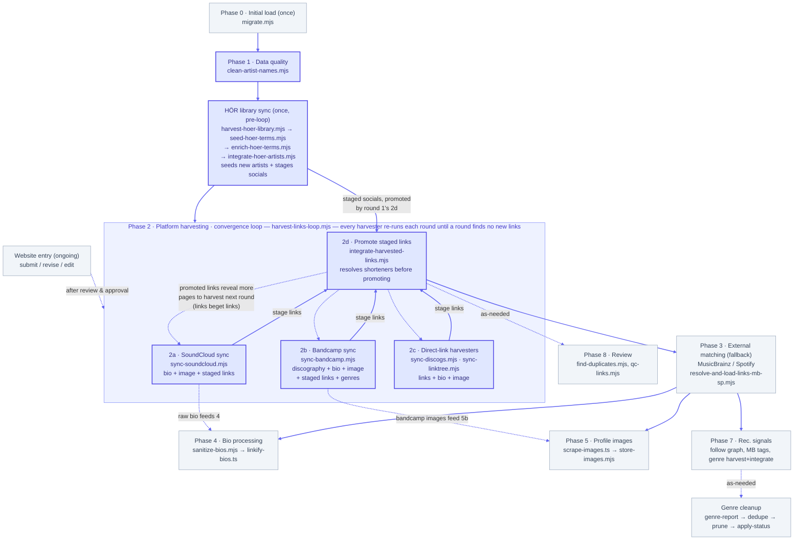

# Enrichment Pipeline

This document describes the logical order in which the enrichment
scripts should be run, and the purpose of each. The goal is to
eventually have a single `orchestrate.mjs` script that calls each
stage in order.

> **Where the spreadsheets go.** Every `.csv` and `.ods` named below is
> written to the `output files/` folder beside the checkout, never into the
> repo. Scripts resolve it through `scripts/lib/output-path.mjs`; set
> `REBALANCE_OUTPUT_DIR` to point somewhere else. Where a script takes a
> sheet as an argument, a bare filename is looked up in that folder and a
> `./`-prefixed one against the working directory. See
> [OUTPUT-FILE-LOCATION.md](OUTPUT-FILE-LOCATION.md).

---

## Overview

```
Phase 0 │ Initial load (run once)
Phase 1 │ Data quality
Phase 2 │ Platform link & profile harvesting (SoundCloud, Bandcamp + direct links)
Phase 3 │ External matching fallback (MusicBrainz, Spotify)
Phase 4 │ Bio processing
Phase 5 │ Profile images
Phase 6 │ (merged into Phase 2b — Bandcamp discography & profile)
Phase 7 │ Recommendation engine signals
Phase 8 │ Review / data quality
```


*(Bold-bordered boxes — Phase 1, the HÖR library sync, and every Phase 2 harvester/promoter (2a SoundCloud, 2b Bandcamp, 2c Discogs/Linktree, and 2d) — are run end to end by `orchestrate-platform-enrichment.mjs --approved`: `clean-artist-names` (Phase 1), then the four-script HÖR library sync ONCE (harvest-hoer-library → seed-hoer-terms → enrich-hoer-terms → integrate-hoer-artists; see `HOER-SYNC-REWORK-PLAN.md`), then the whole of Phase 2 as one convergence loop (`harvest-links-loop.mjs`) that re-runs every harvester each round, promoting newly-staged links via 2d, until a round finds no new links. Each harvester tracks its own DB state, so a round only re-fetches artists whose links arrived since the last round. HÖR is not a loop member (it was, as the retired `sync-hoer.mjs`): only its integrate stage emits staged socials, and its input is fixed before the loop starts, so it runs once up front and round 1's 2d promotes its socials. SoundCloud sync (2a) became a loop member on 2026-07-11 — it stages each profile's "Links" section, and SoundCloud links are themselves discovered mid-loop — so it is no longer a separate pre-loop stage. Solid loop-back arrows carry staged links to 2d; dashed arrows are the loop's feedback, or as-needed / cross-phase / manual-entry paths.)*

Artists enter the database through **two entry points**: the one-time
bulk CSV load (Phase 0), and continuously via the website's
submission/revision flow (see "Ongoing entry point" below, after
Phase 8). The enrichment phases run as bulk scripts, so artists
arriving through the website start with entry-form data only (plus an
auto-fetched profile image) and pick up the rest on the next pipeline
run. This is by design: human review and approval deliberately sit
between a website submission and enrichment.

---

## Running the scripts: always `tsx`, never bare `node`

Scripts in `scripts/` are `.mjs`, but they freely import TypeScript from
`src/lib/` so that facts both the website and the pipeline depend on —
platform URL parsing, the image-failure vocabulary, the placeholder
registry — have exactly one definition. Plain `node` cannot load a `.ts`
file, so it fails at the first such import with `ERR_MODULE_NOT_FOUND`.

Consequences, all of which are easy to get wrong:

- **npm scripts** for anything reaching `src/lib/` use `tsx scripts/…`,
  not `node scripts/…`.
- **Documented invocations** (including the usage comments in each
  script's header) use `npx tsx scripts/…`.
- **Spawned children** go through `scriptRuntime()` in
  `scripts/lib/script-runtime.mjs`, which resolves `tsx` via node's own
  module resolution so it also works from a git worktree. Both spawners
  (`harvest-links-loop.mjs`, `orchestrate-platform-enrichment.mjs`) use
  it for *every* child regardless of extension — a `.mjs` stage needs
  `tsx` exactly as much as a `.ts` one, so the extension is not a usable
  signal.

The simplest rule: run everything in `scripts/` under `tsx`. It executes
plain `.mjs` fine, so there is no case where `node` is required and `tsx`
would not also work.

## Orchestration

All of Phase 2 can be run end to end with a single command via
`orchestrate-platform-enrichment.mjs`:

```bash
npm run orchestrate-platform-enrichment -- --approved
```

It runs, in dependency order: `clean-artist-names` (Phase 1) → the
four-script HÖR library sync (`harvest-hoer-library` →
`seed-hoer-terms` → `enrich-hoer-terms` → `integrate-hoer-artists`;
see `HOER-SYNC-REWORK-PLAN.md`) → `harvest-links-loop` (the
2a+2b+2c+2d convergence loop). The HÖR group runs ONCE before the
loop — it replaced the in-loop `sync-hoer.mjs` seeder (deleted) —
because only its integrate stage emits something the loop consumes
(staged socials) and its input is fixed before the loop starts; each
of its sub-stages is optional, so a HÖR outage doesn't sink the rest
of the run. As of
2026-07-11 `sync-soundcloud` (2a) is one of the loop's harvesters, not
a separate stage before it: it stages the "Links" section of every
SoundCloud profile, and SoundCloud links surface mid-loop (a HÖR or
Discogs page reveals one, 2d promotes it, the next round's 2a reads
that profile), so it converges alongside the other harvesters.
`sync-bandcamp` (2b — the merged discography + bio + location + image +
links + genre-tags stage; see Phase 2b below) is likewise a loop
harvester. Each stage tracks its own processed state in the database,
so the orchestrator holds no state and is safe to re-run — a second
run only touches artists with new data. Note that `store-images.mjs`
(5b) is not part of this orchestrator; run it after the loop to pick
up any SoundCloud/Bandcamp images 2a/2b just found (see "Typical full
run order").

`--approved` restricts every stage to directory artists
(`directory_status = 'approved'`, excluding deleted). It is forwarded to
each child stage, and `harvest-links-loop` forwards it again to its own
children, so one flag governs the whole loop. `clean-artist-names` is a
global name cleanup, so it is the one stage `--approved` is not passed
to. `DRY_RUN=1` (no writes anywhere) and an optional `--max-rounds=N`
(caps the convergence loop) are also honored.

This is the first concrete piece of the "eventual `orchestrate.mjs`"
referenced throughout this doc; later phases can be folded in as
additional stages.

---

## Phase 0 — Initial load *(run once)*

### `migrate.mjs`
Loads the master CSV (`women, femmes, enbies of electronic music - list (genres normalized).csv`)
into the database: artists, genres, locations, and platform links.
Also seeds the `pronouns` lookup from `pronouns_lookup.csv`
(`artists.pronoun_id` references it). Run once when setting up a
fresh database. Refuses to run if `artists` already has rows (to
prevent duplicates).

Prerequisite reference table: **`platforms`** `(key, label,
sort_order)` defines the valid values for `artist_links.platform`
and must be populated before any link-writing phase (2, 3) —
`integrate-harvested-links.mjs` validates keys against it. It is
not seeded by `migrate.mjs`; rows are managed in the admin settings
page (`src/app/admin/actions.ts`).

```bash
DRY_RUN=1 npm run migrate   # verify first
npm run migrate
```

---

## Phase 1 — Data quality

### `clean-artist-names.mjs`
Strips invisible Unicode characters (zero-width marks, control
characters, etc.) and whitespace from the start and end of every
artist name. Should be run after any import or bulk update, and
before enrichment scripts that use names as search queries.

```bash
npm run clean-artist-names
```

---

## Phase 2 — Platform link & profile harvesting

Principle: **gather every platform link we can from artist pages
directly, before relying on inferred matches.** Direct links found
on an artist's own profiles (SoundCloud web-profiles, Discogs,
Bandcamp, Linktree) are ground truth; the best-match resolution in
Phase 3 is the fallback for whatever this phase doesn't find.
Since platforms link to yet other platforms — including Spotify
and MusicBrainz — a thorough pass here fills out the
artist's platform picture for everything downstream (images, bios,
matching, genres) and shrinks the set of artists that need
best-match guessing at all.

2a pulls from SoundCloud in a single merged stage; 2b is the merged
Bandcamp stage (`sync-bandcamp.mjs`, moved here from the former Phase 6
on 2026-07-10); 2c is the direct-link harvesters; 2d promotes. 2a, 2b,
and 2c are all link harvesters, so they all run
inside the 2d convergence loop (`harvest-links-loop.mjs`) — links beget
links, and a SoundCloud, Bandcamp, or Discogs page can each reveal
links the others then read. (2a joined the loop on 2026-07-11; it had
been a separate stage run once before the loop. The label "2b"
previously belonged to a retired SoundCloud harvester,
`harvest-soundcloud-links-and-bio.mjs`, whose work is now part of 2a;
the slot is reused for Bandcamp.)

### 2a. `sync-soundcloud.mjs`
The merged SoundCloud stage (as of 2026-07-09; replaces the former
`enrich-soundcloud.mjs` + `harvest-soundcloud-links-and-bio.mjs`
pair, which each called `GET /resolve?url=<profile-url>` separately
for the same artist — the same call returning the same user
resource). This stage calls it once and fans the result out:

- **Profile data** — bio, follower count, track count, numeric user
  ID, and a playlists fallback for zero-track accounts (`GET
  /users/{id}/playlists`, only called when `track_count` is 0) —
  upserted into `artist_enrichment` (platform = `soundcloud`). Same
  behavior as the old 2a.
- **Profile image** — as of 2026-07-09, the resolved avatar goes to
  `artist_images` (`artist_id`, `platform='soundcloud'`), not
  `artist_enrichment.profile_image_url` (explicitly nulled there
  instead). Approved-only, unconditionally — checked inside
  `syncArtist()` itself regardless of which flags scoped the run,
  since this script otherwise processes non-directory artists too
  (~100x more numerous than directory ones) and there's no reason to
  store images for them. Image completion is tracked independently of
  the main `soundcloud-sync` completion (see "Image-only pass" below),
  since the two can diverge: an artist synced as a non-directory node
  and approved later needs just the image, not a full re-sync.
- **Other-platform links** — fetched via `GET
  /users/{urn}/web-profiles` (the "Links" section) plus a scan of the
  raw bio text for plain URLs and gate.sc-wrapped links — staged into
  `artist_harvested_links` (never written directly to `artist_links`;
  `integrate-harvested-links.mjs`, 2d, promotes it). Same behavior as
  the old 2b.
- **Raw bio** — the full, unparsed bio text is kept in
  `artist_harvested_bios` as a raw-bio audit trail, alongside the
  parsed/cleaned bio that reaches the live `artist_enrichment.bio` and
  `biographies` (`platform = 'soundcloud'`, the one-bio-per-artist-per-
  platform home shared with Bandcamp/Discogs). See
  `supabase_migration_backfill_soundcloud_bandcamp_bios.sql` for the
  one-time backfill of pre-existing bios out of `artist_harvested_bios`.

Two API calls per artist (`/resolve` + `/users/{urn}/web-profiles`)
is the floor — SoundCloud has no endpoint that returns the user
resource and web-profiles together — down from three under the old
two-script version.

**Fetch by stored id on re-runs (since 2026-07-11).** The first
successful sync records the user's numeric id in
`artist_enrichment.external_id`. Any later run for that artist (a
`--force` re-sync, a link-changed retry, the image-only pass, or
`--links-only`) fetches the same user resource by id — `GET
/users/{id}` — instead of `GET /resolve?url=<profile-url>`: same
resource and cost, but it skips the resolve step and is immune to the
artist renaming their profile URL (the id never changes; a rename
breaks the stored URL and would 404 a resolve). `main()` loads those
ids scoped to just the artists a run will touch (chunked `.in()`
queries on the `(artist_id, platform)` index), never scanning the
whole enrichment table. Resolve-by-URL only runs on a first sync, when
no id exists yet — which is also the only path where the wrong-field
guard is meaningful (a stored id means the URL already resolved once).

**`--links-only` refresh (since 2026-07-11).** Re-fetches *only* the
web-profiles "Links" section (from the stored id, one API call, no
`/resolve`) and re-stages the harvested links, for every matching
already-synced artist. Skips the user resource, bio, image, and
playlists, and touches no completion/failure state — a links refresh
doesn't change main-sync completeness, so there's nothing to mark done
or un-stick; failures are logged and tallied only. Respects
`--approved` / `--name` / `--status` / `--limit`.

**Runs inside the 2d convergence loop (since 2026-07-11).** 2a used to
run once as a standalone stage before the loop. It now sits in
`harvest-links-loop.mjs`'s `HARVESTERS` array alongside 2b/2c, because
it both *stages* links (each profile's "Links" section →
`artist_harvested_links`) and *consumes* them (it needs a `soundcloud`
`artist_links` row to know which profile to fetch) — and SoundCloud
links are discovered mid-loop (a HÖR seed or a Discogs page reveals one,
2d promotes it, the next round's 2a reads that profile, whose
web-profiles may reveal yet more links). Because it tracks processed
state in the DB (`resolved_artists`, service `soundcloud-sync`), each
round only re-fetches artists whose SoundCloud link arrived since the
last round, so the loop still terminates. Unlike `sync-bandcamp` (2b),
which is hardwired directory-only, 2a keeps `--approved` as its
directory gate, so the loop/orchestrator must forward `--approved` (it
does) to keep it directory-only; its non-directory `sc_followee`
counterpart is handled entirely by `build-soundcloud-follow-graph.mjs`
(Phase 7a), never here.

**Shared SoundCloud client.** The OAuth token flow, the authenticated
GET wrapper, and the SoundCloud-URL helpers live in
`scripts/lib/soundcloud.mjs` (added 2026-07-11), shared with
`build-soundcloud-follow-graph.mjs` (Phase 7a) — the two used to carry
verbatim copies of that code. The lib knows how to talk to SoundCloud
and normalize its URLs; each caller decides what to write.

**Wrong-field URL guard:** on a first sync (resolve-by-URL; a re-run
with a stored id bypasses the URL entirely), before calling `/resolve`
the stored `artist_links.url` is checked against the `soundcloud.com`
domain. A
mismatch (e.g. a Spotify URL saved in the SoundCloud field) is
skipped without spending an API call, logged to `harvest_failures`
(below), and — same as a 404 — marked processed in `resolved_artists`:
a domain mismatch doesn't fix itself on retry, so leaving it unmarked
would just re-write the same failure row and re-run the same guard
check every future run forever, for no benefit. The link-change
cross-check described below still picks it back up automatically once
a human corrects the link — no `--force` needed.

**Failure persistence:** every resolve/write failure — wrong-field
skips, 404s, transient resolve failures, and DB write failures — is
recorded in the `harvest_failures` table (service = `soundcloud-sync`,
via `scripts/lib/harvest-failures.mjs`: a short machine-readable
`status`, a human-readable `detail`, and the offending `url`), so a
scheduled/unattended run's failures are queryable afterward instead
of living only in console scrollback. A later successful sync clears
the row for that artist. Of the four failure statuses
(`wrong_field_url`, `resolve_404`, `resolve_failed`, `write_failed`),
`wrong_field_url` and `resolve_404` mark the artist processed
(permanent until a human fixes something); `resolve_failed` and
`write_failed` are presumed possibly-transient and retry on every run
regardless. A single local `fail()` helper inside `syncArtist()` is
the one place that decides which statuses mark the artist done (a
`markDone` flag), rather than that decision being repeated inline at
each failure site.

Processed state is tracked in the database (`resolved_artists`,
service = `soundcloud-sync`), not a cache file — per project
convention. An artist is skipped once a state row exists; re-runs
only touch artists that haven't been marked done. An artist is marked
processed once every write for it succeeds, or on a resolve HTTP 404
(definitive dead link) or a wrong-field URL (definitively not a
SoundCloud link); transient resolve/write failures are left unmarked
so the next run retries them.

A 404- or wrong-field-marked artist isn't stuck forever: `resolved_artists`
only records "done for this artist_id", not which URL was checked, so
a link fix wouldn't otherwise be picked up without `--force` (which
reprocesses everyone). Each run cross-references the URL
`harvest_failures` recorded at failure time against the artist's
current `artist_links` row (via `loadFailureUrls()` in
`scripts/lib/harvest-failures.mjs`); if they differ — a human
corrected the link since — that one artist is retried automatically.
(Found 2026-07-09: Maisie fixed a 404'd artist's link through the
admin UI and a re-run didn't pick it up — the cross-check was built to
fix that, then generalized to also cover `wrong_field_url` once it
became clear that status should mark the artist processed too, for
the same "doesn't fix itself on retry" reason as a 404.)

**Failures CSV:** every run (`DRY_RUN` or not) also writes a snapshot
of every current `soundcloud-sync` row in `harvest_failures` to a CSV
— `artist_name`, `artist_page_url` (the artist's live page on the
site, `NEXT_PUBLIC_SITE_URL` + `/artist/{id}`, so a reviewer can click
straight through), `status`, `url` (the SoundCloud link that failed),
and `occurred_at`, sorted by status then most-recent-first. Written to
`sync-soundcloud-failures-<YYYY-MM-DD_HHMMSS>.csv` one level up from
this repo — the "Rebalance Gender" folder, not inside
`rebalance-gender-repo` — same convention as
`other-links-domain-counts.mjs`; the timestamped filename means
re-running never overwrites a previous run's report. See
`writeFailuresCsv()`.

**Image-only pass:** each run, `main()` separates already-synced
artists (a genuine `soundcloud-sync` success, not a still-unresolved
permanent failure) into a second bucket — those that are now approved
but still missing a soundcloud `artist_images` row — and runs
`syncArtist(artist, { imageOnly: true })` for them: one `/resolve`
call for the avatar, skipping playlists/web-profiles/bio/link writes
and leaving `resolved_artists` untouched. Image-only failures persist
to their own `harvest_failures` service (`image:soundcloud`, via
`failImage()`), separate from `soundcloud-sync`'s, with the same
link-changed-since-failure cross-check applied independently — a 404
found only by the image-only path doesn't pollute the main sync's
(already-successful) failure state.

```bash
npm run sync-soundcloud
npm run sync-soundcloud -- --approved   # directory artists only
npm run sync-soundcloud -- --force      # re-process even artists with existing state
npm run sync-soundcloud -- --debug      # log raw API responses + every candidate link found
DRY_RUN=1 npm run sync-soundcloud       # fetch + log, no DB writes
```

`--approved` restricts the run to directory artists (`directory_status = 'approved'`, excluding deleted) rather than every artist with a SoundCloud link (mostly unvetted `sc_followee` follow-graph nodes).

Requires `SOUNDCLOUD_CLIENT_ID` and `SOUNDCLOUD_CLIENT_SECRET` in `.env.local`.

The per-artist sync is an exported `syncArtist()` function; the CLI
loop in `main()` is a thin driver over it — the same shape a future
event-triggered call (e.g. "sync this one artist from SoundCloud on
admin approval," the pattern `src/lib/scrape-images.ts` already uses
for images) can call directly for a single artist instead of a bulk
run.

Artists already synced under the old two-script system have
`resolved_artists` rows for `soundcloud-enrich` and
`soundcloud-harvest`, not `soundcloud-sync` — run
`backfill-resolved-soundcloud-sync.mjs` first (see "Utility /
diagnostic scripts") so the first bulk run of this stage doesn't
re-fetch everyone from scratch.

### 2b. `sync-bandcamp.mjs`
Merged 2026-07-09 (replaces `enrich-bandcamp.mjs`); moved here from the
former Phase 6 and folded into the convergence loop as 2b on
2026-07-10. The Bandcamp analog of `sync-soundcloud.mjs` (2a): one page
fetch per artist (`{core url}/music`, falling back to the core URL),
fanned out to every concern that page can answer instead of just
discography —

- **Discography** — album/track grid → `artist_bandcamp_albums` (the
  numeric IDs feed Bandcamp's embedded player). Same scrape
  `enrich-bandcamp.mjs` did.
- **Bio** → `artist_enrichment` (`platform = 'bandcamp'`) and
  `biographies` (`platform = 'bandcamp'`, the one-bio-per-artist-per-
  platform home), plus the raw bio into `artist_harvested_bios` as an
  audit trail (same pattern SoundCloud's bio gets). Bandcamp's scraped
  bio is already plain text, so the same string lands in `biographies`
  and `artist_harvested_bios`.
- **Profile image** → as of 2026-07-09, `artist_images` (`artist_id`,
  `platform='bandcamp'`), not `artist_enrichment.profile_image_url`
  (explicitly nulled there instead). Written as a raw `source_url`
  only — re-hosting to Storage is `store-images.mjs`'s job (5b). No
  extra directory-only gating needed here (unlike SoundCloud): this
  whole script already only ever processes `directory_status =
  'approved'` artists, unconditionally — see "Processed state" below.
- **Location** → `artist_locations`, only when the artist doesn't
  already have a row there (never overwrites a manual entry).
- **External links sidebar** → staged into `artist_harvested_links`,
  same contract as every other harvester (promoted by
  `integrate-harvested-links.mjs`, 2d). This is what makes 2b a
  first-class member of the convergence loop, not just a profile
  scrape — see "Runs inside the 2d convergence loop" below.
- **Genre tags** (release pages only) → staged into
  `artist_harvested_genres` (`source_platform = 'bandcamp'`), same
  shape as the MusicBrainz/Spotify genre harvesters.

Handles three page shapes beyond the "full page with releases" case,
since Bandcamp reuses the same bio-container sidebar partial across
all of them: an artist with a bio but no releases (the `/music` page
stays on that path, just with an empty grid); an artist whose core URL
redirects to their one track (no `/music` landing page exists at all);
and an artist whose core URL redirects to a merch item. In all three,
discography is naturally empty but bio/location/links are still
harvested. A URL that isn't a real Bandcamp artist subdomain (e.g. a
saved `bandcamp.com/search?...` link) is rejected before any fetch —
see the wrong-field guard in the script header. Not harvested: fan/
supporter counts (loaded client-side, not in the static HTML) and
release credits text (captured opportunistically into the archived page
blob in `api_response_cache`, namespace `bandcamp_page`, not promoted to
a column — a future collaboration-signal enhancement, same status as
Discogs' `members`/`groups`).

**Runs inside the 2d convergence loop.** Because 2b both *stages*
links (its sidebar → `artist_harvested_links`) and *consumes* links (it
needs a Bandcamp `artist_links` row to know which page to fetch), it
belongs in the same round-based loop as the direct-link harvesters (2c)
rather than as a terminal step: a Discogs page found in one round can
reveal a Bandcamp URL, 2d promotes it, and the next round's 2b then
reads that Bandcamp page — which may itself reveal more links. It is
listed in `harvest-links-loop.mjs`'s `HARVESTERS` array alongside
`sync-discogs.mjs`, so `orchestrate-platform-enrichment.mjs`
picks it up automatically; there is no separate Bandcamp stage in the
orchestrator anymore. Because it tracks processed state in the DB (see
below), each round only re-fetches artists whose Bandcamp link arrived
since the last round, so the loop still terminates naturally.

Benefits from the SoundCloud sync (2a) and the other harvesters
running: the more Bandcamp links they surface, the more profiles 2b
fetches.

Always directory-only: it processes only artists with
`directory_status = 'approved'` (excluding deleted), so there is no
`--approved` flag — the loop/orchestrator forwards one anyway, a
harmless no-op here.

**Processed state:** uses `resolved_artists` (service =
`bandcamp-sync`) and `harvest_failures` for processed-state and failure
tracking — same pattern as `sync-soundcloud.mjs` (2a). The old
`enrich-bandcamp.mjs` never used `resolved_artists`, so there's no
prior state to backfill.

```bash
npm run sync-bandcamp
```

### 2c. Direct-link harvesters

#### `sync-discogs.mjs` — ✅ one-call Discogs sync (2026-07-10, replaces `harvest-links-discogs.mjs`)
The Discogs analog of `sync-soundcloud.mjs`/`sync-bandcamp.mjs`, and the
successor to the link-only `harvest-links-discogs.mjs`. One call to the
official Discogs API (`GET /artists/{id}`) per artist, fanned out to
everything that resource answers:

- **External links** (`urls`) → staged into `artist_harvested_links`
  (source_platform = `discogs`); never written to `artist_links`
  directly — 2d promotes. (Same as the old harvester.)
- **Alt name spellings** (`namevariations`) → `artist_aliases`
  (deduped against existing aliases and the artist's own name; never a
  wholesale delete+insert, so human-entered aliases are preserved).
  Discogs `aliases` — *separate* personas/side-projects — are
  deliberately **not** written to `artist_aliases`, since collapsing a
  different identity into one directory entry is usually wrong. They are
  not discarded, though: the full response (below) retains them for
  possible later use — see Planned changes → "Harvest Discogs `aliases`
  from the stored blobs".
- **Real name** (`realname`) → `artist_legal_names` (`platform =
  'discogs'`), a **private** table with no public read (see
  `supabase_migration_artist_legal_names.sql`) — shared with HÖR's
  legal-name capture (`integrate-hoer-artists.mjs`). Kept for
  dedup/disambiguation,
  never shown publicly — exposing a legal name risks deadnaming or
  outing an artist who performs under a chosen name.
- **Profile text** (`profile`) → `biographies` (new table; `platform =
  'discogs'`), with Discogs `[a=]`/`[url=]`/`[b]` markup stripped to
  plain text; the raw text also goes to `artist_harvested_bios` as an
  audit trail (same as SoundCloud/Bandcamp). `biographies` is the
  one-bio-per-artist-per-platform home for bios. SoundCloud (2a) and
  Bandcamp (2b) now write it directly too; their pre-existing bios were
  backfilled out of `artist_harvested_bios` by
  `supabase_migration_backfill_soundcloud_bandcamp_bios.sql`.
- **Group membership** (`members`/`groups`) → `collaborations` (the
  renamed, platform-neutral `mb_collaborations`; `source_platform =
  'discogs'`), one undirected edge per pair, but **only** when the
  related Discogs artist is also in our DB (matched via its own Discogs
  link) — mirrors `enrich-musicbrainz.mjs`. This is the
  recommendation-engine payoff of the expanded sync.
- **The full raw response** → `api_response_cache` (namespace
  `discogs-artist`, cache_key = the numeric Discogs id), upserted on
  every successful fetch and part of the same all-writes-succeeded gate
  as the concerns above. This table has **no TTL** (2026-07-10 — see
  MATCHING.md → "Response cache"), so the blob persists as a durable
  archive: any field the fan-out doesn't extract yet — `aliases`,
  `images`, `data_quality`, … — can be mined later without re-calling
  the rate-limited API. There is no `artist_id` column; a blob is
  reconnected to its artist by parsing the Discogs id out of the
  artist's `artist_links` (`platform = 'discogs'`) row — the same
  `discogsIdToArtist` map the script already builds for collaborations.

Because it still stages links, it stays a full member of the 2c/2d
convergence loop. Processed state uses a **new** `resolved_artists`
service, `discogs-sync` (not the old harvester's `discogs-links`), so
the expanded sync re-processes everyone once to capture the new fields;
the old `discogs-links` rows are harmless and simply go unused. Failures
persist to `harvest_failures` (service `discogs-sync`) with the same
link-changed cross-check as the other sync scripts. Old-format
name-based Discogs URLs are still resolved to `/artist/<id>` via the
search API and rewritten back to `artist_links`. Throttled to ~55
req/min (Discogs allows 60/min authenticated).

```bash
npm run sync-discogs
npm run sync-discogs -- --approved    # directory artists only
npm run sync-discogs -- --limit=20    # test run
npm run sync-discogs -- --force       # re-process all
npm run sync-discogs -- --debug       # log every field/link classified
DRY_RUN=1 npm run sync-discogs        # fetch + log, no writes
```

`--approved` restricts the run to directory artists (`directory_status = 'approved'`, excluding deleted).

Requires `DISCOGS_TOKEN` in `.env.local` (discogs.com → Settings →
Developers → "Generate new token").

**Migrations to run first** (Supabase SQL editor):
`supabase_migration_collaborations.sql` (rename + `source_platform`) and
`supabase_migration_artist_legal_names.sql` (private real/legal-name table).

Bandcamp link harvesting is done — folded into `sync-bandcamp.mjs` (2b)
rather than built as a separate 2c script, since it's the same page
fetch as the discography scrape; 2b runs in this same convergence loop.

#### `sync-linktree.mjs` — ✅ Linktree sync (2026-07-10)

The Linktree analog of `sync-soundcloud.mjs` / `sync-bandcamp.mjs`. For
each artist with a `linktree` link in `artist_links`, it fetches the
`linktr.ee` page once and fans the result out:

- **External links** → staged into `artist_harvested_links`
  (`source_platform = 'linktree'`); promoted by 2d as usual. A Linktree
  page exists precisely to list an artist's other platforms, and those
  links are themselves discovered mid-loop, so this is a full member of
  the 2c/2d convergence loop (`harvest-links-loop.mjs`).
- **Bio / tagline** → `biographies` (`platform = 'linktree'`) + the raw
  text into `artist_harvested_bios` (audit trail). Genres are **not**
  parsed from it here — Linktree taglines often carry genre hints
  ("HARD TECHNO/HARD MUSIC DJ AND PRODUCER"), but pulling genres from
  freeform bios is a deliberate future cross-platform pass over
  `artist_harvested_bios`, not bolted onto this script.
- **Profile image** → `artist_images` (`platform = 'linktree'`),
  approved-only (checked inside `syncArtist`, since Linktree links get
  attached to non-directory `sc_followee` nodes too), re-hosted by
  `store-images.mjs` (5b). Deliberately **held back from the public
  display rotation** for now — a Linktree avatar is sometimes a logo or
  event flyer, not an artist photo — via the `platform = 'linktree'`
  exclusion in `src/lib/artist-images.ts` (`DISPLAY_EXCLUDED_PLATFORMS`).
  Still captured/re-hosted so the decision can be revisited.

**Link classification — the Linktree-specific twist.** Unlike the
curated "my links" lists the other harvesters read, a Linktree commonly
holds dozens of one-off links (event tickets, merch, a single release).
Classifying those as `other` would flood staging and, worse, let 2d
promote one arbitrary junk `other` link (since `other` *is* a
`platforms` key). So a recognized domain gets its canonical platform
key, and **every unrecognized domain is staged under its bare domain**
(e.g. `dice.fm`) as `parsed_platform`, never `other`. 2d only promotes
rows whose `parsed_platform` is a `platforms` key, so bare-domain rows
stay staged and un-promoted until that domain is added to the known
list — then a 2d re-run promotes the already-gathered backlog.

**Wrong-field guard + failures.** The stored link's host is checked
against `linktr.ee` before any fetch; a mismatch is flagged
(`harvest_failures`, service `linktree-sync`) and marked processed, with
the same link-changed cross-check the other syncs use. Parsing reads the
`__NEXT_DATA__` JSON blob (`linktr.ee` is a Next.js app that SSRs the
profile data), with HTML fallbacks (`og:description`, the
`ugc.production.linktr.ee` avatar, body anchors). No token, no headless
browser. Every run also writes `sync-linktree-failures-<ts>.csv` one
level up from the repo.

```bash
npm run sync-linktree
npm run sync-linktree -- --approved    # directory artists only
npm run sync-linktree -- --limit=20    # test run
npm run sync-linktree -- --force       # re-process all
npm run sync-linktree -- --debug       # log every link classified
DRY_RUN=1 npm run sync-linktree        # fetch + log, no writes
```

No token needed (`linktr.ee` pages are public).

#### `harvest-links-loop.mjs` — the 2a+2b+2c+2d convergence loop
Runs every platform harvester — 2a (`sync-soundcloud.mjs`, which stages
each profile's "Links" section), 2b (`sync-bandcamp.mjs`, the Bandcamp
sidebar), and the 2c direct-link harvesters (`sync-discogs.mjs`,
`sync-linktree.mjs`) — then 2d, in
rounds until a round produces no new staged or live links (links beget
links: a Discogs page may reveal a Bandcamp URL, a HÖR page a SoundCloud
URL, 2d promotes it, and the next round's harvester reads that page to
reveal yet more links). The `HARVESTERS` array is the extension point —
2a was added to it on 2026-07-11 (it had been a standalone pre-loop
stage). HÖR is no longer a loop member: the retired in-loop
`sync-hoer.mjs` seeder was replaced by the four-script HÖR library
sync, which the orchestrator runs once BEFORE this loop — only its
integrate stage emits staged socials, whose input is fixed up front,
so round 1's 2d promotes them and the loop feeds on them from there
(see `HOER-SYNC-REWORK-PLAN.md`). Convergence is detected by row counts of
`artist_harvested_links` and `artist_links` before vs. after each
round; because harvesters track state in the DB, each round only
touches artists with new links. This loop is the skeleton for the
eventual `orchestrate.mjs`.

```bash
npm run harvest-links-loop
npm run harvest-links-loop -- --approved       # directory artists only
npm run harvest-links-loop -- --max-rounds=2
DRY_RUN=1 npm run harvest-links-loop           # single round, no writes
```

`--approved` restricts the loop to directory artists (`directory_status = 'approved'`, excluding deleted); it is forwarded to every child stage (the 2a/2b/2c harvesters and 2d). `sync-bandcamp` is already directory-only, so the flag is a harmless no-op there; `sync-soundcloud` (2a) relies on it (it keeps `--approved` as its directory gate), so forwarding it is what keeps 2a directory-only inside the loop.

### 2d. `integrate-harvested-links.mjs`
Promotes rows from the `artist_harvested_links` staging table into
the live `artist_links` table. One surviving link per
(artist, platform) pair is inserted if no link exists yet; if one
already exists, the script flags any discrepancy for review but
does not overwrite.

Before any of that, staged URLs whose real target is only knowable
over the network — `on.soundcloud.com` share links, `bit.ly`,
`soundcloud.app.goo.gl` and friends — are followed to their
destination and rewritten, so a shortener is never promoted as if it
were a profile URL. That step is shared with the website save paths
and a backfill script; see **URL resolution** below for the host
table and the rules. `raw_url` keeps the link exactly as scraped;
only `parsed_url` carries the destination.

Staged rows whose `parsed_platform` isn't a key in the `platforms`
table are skipped (left in staging, reported in the run summary)
until the key is added via the admin settings page — then a re-run
promotes them. All platforms the current harvesters emit, including
`youtube`, `facebook`, and `tiktok` (keys added 2026-07-03), are
valid.

Discrepancy detection normalizes both URLs before comparing —
scheme, `www.`, trailing slash, and hostname case are ignored, and
known tracking/share params (Spotify's `si`/`nd`/`context`,
`utm_*`, Instagram's `igsh`/`igshid`, `fbclid`, `gclid`, YouTube's
`feature`/`pp`) are stripped — so a harvested link carrying a share
param doesn't falsely flag against a clean live URL.

```bash
npm run integrate-harvested-links
npm run integrate-harvested-links -- --approved   # directory artists only
```

`--approved` restricts promotion/flagging to directory artists (`directory_status = 'approved'`, excluding deleted).

(The former 2e/2f one-off cleanup passes — `fix-http-https-mismatches.mjs`
and `clean-bandcamp-urls.mjs` — have been retired from the pipeline; see
"Legacy scripts".)

---

## URL resolution — shortened and share links

Some links can't be canonicalized by string manipulation at all: their
path is an opaque id and the only way to learn where they point is to
follow the redirect. SoundCloud's mobile share sheet hands out
`on.soundcloud.com/8KP9u6WaRSeo1ycHww`; a Linktree page lists
`soundcloud.app.goo.gl/N1oiE`; a bio carries a `bit.ly`.

This is **one shared implementation with three triggers**, deliberately:
the codebase previously had two divergent copies that disagreed on
timeout, on whether the query string survived, and on whether the
destination was checked at all. Between them they covered two hosts,
while a census of all live and staged links found fourteen.

| | Where | When |
|---|---|---|
| **Website saves** | `scheduleLinkResolution` → `after()` | After the response, per artist |
| **Pipeline 2d** | `integrate-harvested-links.mjs` | Before promoting staged rows |
| **Backfill** | `resolve-link-redirects.mjs` | On demand, over `artist_links` |

The code lives in `src/`, not `scripts/lib/`, because the website needs
it too:

- **`src/lib/resolve-url-redirects.ts`** — the network core and the host
  table. Answers only "where does this point"; it never canonicalizes,
  which stays with `classify-platform-url.ts` and `profile-links.ts`.
  Never throws: every failure returns the original URL, so a caller can
  always store the result unguarded.
- **`src/lib/resolve-artist-links.ts`** — row policy for `artist_links`.
  Resolve, reclassify, canonicalize, recompute the handle, preserve the
  pre-resolution URL in `original_url` (only when empty, so re-runs are
  idempotent).
- **`src/lib/schedule-link-resolution.ts`** — the `after()` wrapper.
  Separate module so `scripts/` can import the policy without dragging
  in `next/server`.

### The host table

Hosts are tiered, and the tier decides how much a redirect is trusted.
**This distinction is the whole design**, so change it carefully: every
host below was probed live, and "follow the redirect, keep what comes
back" turned out to be wrong for more than half of them.

**Tier A — resolve, then require a believable destination.** The target
platform is known up front, so anything else is treated as a failure and
the original link is kept.

| Host | Must land on |
|---|---|
| `on.soundcloud.com` | `soundcloud.com` |
| `soundcloud.app.goo.gl` | `soundcloud.com` |
| `fb.me` | `facebook.com` |
| `spotify.link` | `open.spotify.com` |
| `vm.tiktok.com` | `tiktok.com/@handle` |

`spotify.link` and `vm.tiktok.com` currently **always** fail that check —
the first bounces to a Branch deep link (`spotify.app.link/…`), the
second to the bot-blocked TikTok homepage (`tiktok.com/?_r=1`). Both are
worse than the link we started with. They stay listed on purpose: the
validation is what makes them safe to attempt, and if either service
starts answering bots properly their rows resolve with no code change.

**Tier B — generic shorteners.** The destination is unknowable by
nature, so whatever comes back is reclassified by domain:
`bit.ly`, `goo.gl`, `tinyurl.com`, `shorturl.at`, `cutt.ly`, `ow.ly`,
`rb.gy`, `buff.ly`.

**Tier C — deliberately never resolved.** Listed in code as
`NOT_RESOLVED_HOSTS` with a reason each, so nobody re-adds them thinking
they were an oversight:

- `lnk.to`, `ffm.to`, `smarturl.it`, `hyperurl.co` — music smart-links.
  They answer 200 at their own URL and fan out to many stores via JS;
  there is no single real target.
- `youtu.be` — deterministic, so no network call is warranted, and these
  are *video* links rather than channels.
- `maps.app.goo.gl` — a venue pin, not an artist link. This is why host
  matching is **exact**: it must not be confused with
  `soundcloud.app.goo.gl` or with `goo.gl`.

### Rules that apply everywhere

- **A dead destination is not an improvement.** A shortener can resolve
  perfectly to a profile that 404s; those rows are reported and left
  alone rather than overwritten.
- **`"other"` never overrides a stored platform.** It is the
  classifier's fallback ("no rule matched"), not a finding — treating it
  as one would downgrade the keys that live outside the shared domain
  table (`homepage`, `djanes`, `1001tracklists`, `hoer`).
- **Resolution reclassifies.** A `soundcloud.app.goo.gl` row is filed
  under `other` *because* classification ran on the shortener's own
  hostname; resolution is the moment that becomes knowable, so platform
  and handle are corrected too, not just the URL.
- **Nothing merges two links.** If a resolved row would land on an
  `(artist_id, platform)` pair the artist already holds, that is
  reported, never guessed at — see `--delete-duplicates` below for the
  one exception.

### `resolve-link-redirects.mjs` — the backfill

Walks `artist_links`, resolves what it can, and writes a CSV of every
row it examined to the output folder (see `OUTPUT-FILE-LOCATION.md`).

```bash
npm run resolve-link-redirects -- --dry-run            # report only
npm run resolve-link-redirects                         # rewrite live rows
npm run resolve-link-redirects -- --delete-duplicates  # also drop redundant copies
npm run resolve-link-redirects -- --host=goo.gl        # one host only
npm run resolve-link-redirects -- --approved           # live directory artists only
npm run resolve-link-redirects -- --artist=<uuid>      # one artist
npm run resolve-link-redirects -- --ids=12,34          # specific rows
```

`--approved` restricts the scan to links whose artist is in the live
directory (`directory_status = 'approved'` and not soft-deleted), the
same meaning the flag has in `sync-linktree.mjs` and `scrape-images.ts`.
Every row costs a network round trip and most of `artist_links` hangs
off artists no page renders yet, so this is the cheap run when the point
is the links people can actually click. It narrows the scan, it does not
change any decision — the unfiltered run is still the one that drains
every `after()` that never fired, so it stays worth running eventually.

**There is no queue table**, and that is the point: the set of rows
needing resolution is exactly "rows whose host is in the tier table",
which is derivable from the URL itself. This scan *is* the queue and
this script *is* the drain. So a website save whose `after()` callback
never ran — cold start, deploy mid-request — leaves a row the next run
picks up, with no bookkeeping to fall out of sync; and adding a host to
the tier table re-enqueues all of history for free.

`--delete-duplicates` removes only rows whose resolved URL is *exactly*
what the artist already holds under the right platform (an unresolved
shortener under `other`, duplicating a link already shown on the public
page). It never touches a genuine collision, where the two links differ
and a person has to choose. Off by default here and in
`resolveArtistLinks`, so the website save paths never delete anything.

A run that resolves nothing is the steady state, not a failure: rows
that can't be resolved (dead destinations, validation failures,
smart-links) are reported on **every** future run by design.

Ran against production 2026-08-16: 28 rows rewritten, 3 redundant rows
removed, 24 left alone. Full history in `URL-RESOLUTION-PLAN.md`.

---

## Phase 3 — External matching (fallback)

The **fallback** for MusicBrainz and Spotify links that
Phase 2's direct harvesting didn't find on artists' own pages: a
direct link is ground truth, a best match is an inference with a
confidence score. Runs directly after Phase 2 so all the
link-finding steps sit together in the process; its inputs are
only artist names, locations (`artist_locations`), and raw bios
(`artist_enrichment`, from 2a). Its links are then available to
the image and later phases. (It was formerly Phase 6, after
images; moved up and reframed as fallback 2026-07-03.)

Note: today the resolver only skips searching a service when the
artist already has a *Spotify* link; extending that skip to
MusicBrainz (so direct links found in Phase 2 suppress the search
entirely) is in "Planned changes".

Last.fm was the third service here until 2026-07-30, when Last.fm data
was removed from the directory (see
`supabase_migration_remove_lastfm_data.sql`). Existing Last.fm links are
retained but no new ones are resolved.

### `resolve-and-load-links-mb-sp.mjs`
Searches MusicBrainz and Spotify for each directory
artist by name, scores and ranks candidates by name similarity,
location, and bio overlap, and upserts the best matches into
`artist_links`. Candidates below the confidence threshold
(`0.95`) are staged in `pending_artist_links` for manual review.

```bash
npm run resolve-and-load-links
```

State tracking: the resolver decides an (artist, service) pair is
already done by checking for existing `pending_artist_links` rows.
The orphaned `resolved_artists` table `(artist_id, service,
resolved_at)` — created in the dashboard, referenced by no code —
was evidently intended as an explicit tracker for exactly this.
Adopting it would make incremental re-runs cleaner than the current
inference (and fits the project preference for DB-tracked state
over cache files).

Full documentation of this script — flags, scoring, statuses, and
caveats — is in `MATCHING.md`. Note that no current-stack tool
processes the staged `close match` / `tie` / `pending` rows; the
legacy Python scripts (`review_candidates.py` export/import +
`load_links.py`) are still schema-compatible and remain the only
review workflow. See `MATCHING.md` for the comparison of the two
pipelines.

---

## Phase 4 — Bio processing

Must run after Phase 2 so bios are present in `artist_enrichment`.
No other phase depends on sanitized bios (Phase 3's matcher reads
the *raw* bios from 2a), so this can run any time before the site
displays them; it sits here to keep Phases 2–3, the link-finding
steps, adjacent.

### 4a. `sanitize-bios.mjs`
Runs every raw bio through `sanitize-html` (pure Node, no DOM
required — replaced `isomorphic-dompurify` 2026-07-05): strips
unsafe tags and attributes, converts bare newlines to `<br>` for
plain-text bios, adds `target="_blank" rel="noopener noreferrer"` to
all links. Writes to `bio_sanitized` in `artist_enrichment`. Skips
rows that already have `bio_sanitized` set (use `--force` to
re-sanitize). Uses keyset pagination on `id`, so `--limit` caps the
query itself rather than trimming an over-fetched batch.

```bash
npm run sanitize-bios
```

### 4b. `linkify-bios.ts`
Post-processes `bio_sanitized` to wrap bare URLs in `<a>` tags and
convert `@mentions` to SoundCloud profile links. Idempotent —
already-linked text is skipped.

```bash
npm run linkify-bios
```

---

## Phase 5 — Profile images

Runs after Phase 3 so image enrichment can draw on the full link
set, including the Spotify and Wikipedia links Phase 3 resolves
(both of which are in the platform priority list below).

### 5a. `scrape-images.ts` — multi-platform + `artist_images` 2026-07-09
For each artist with `directory_status = 'approved'` (checked inside
`scrapeArtistImages()` itself, not just at the call site — no flag or
future caller can bypass it), tries **every** linked profile the
artist has, not just the first hit, and pulls the `og:image` meta tag
as a best-effort profile photo from each one. No API key required.
Supports `--missing-only`, `--limit=N`, `--force`, `--platforms=a,b`,
`--approved` (a no-op — see below), and `DRY_RUN=1`.

**`--missing-only` (2026-08-12)** narrows the run to approved artists
with **no displayable image at all** — the ones whose cards and profile
pages currently show nothing. It's the "fill the visible gaps first"
mode: a full run walks every approved artist and spends two DB
round-trips each rediscovering that most are already covered, while
this loads `artist_images` once up front (paged on its
`(artist_id, platform)` primary key) and skips those artists outright.
As of 2026-08-12 that is 715 of 3,330 approved artists, so a run is
~4× shorter. Coverage is judged by the same rule the front end renders
by — `isDisplayablePlatform()` in `src/lib/artist-images.ts` — so an
artist whose only stored image is a held-back one (linktree; 2 artists
today) still counts as missing, because the site shows them nothing.
It is not a substitute for a full run: an artist who already has, say,
a spotify image but has since gained a youtube link is invisible to
this mode. Combines with every other flag; with `--limit=N` the cap
applies to the artists that survive the filter, not to the rows fetched.

`--approved` is accepted and does nothing: this script is
unconditionally approved-only (the guard is inside
`scrapeArtistImages()`). It exists so the orchestrator's directory-only
flag can be passed through without looking like it changed the run —
the flag is recognised and reported as a no-op in the run header rather
than silently swallowed. The orchestrator still doesn't forward it.

Writes one row per successful platform to `artist_images`
(`artist_id`, `platform`, `source_url`, ...) — see
`supabase_migration_artist_images.sql` — rather than a single
`artists.profile_image_url` winner, so an artist can hold images from
several platforms at once instead of one platform's pick silently
overwriting another's. `soundcloud` and `bandcamp` belong to their own
dedicated, better-guarded harvesters (`sync-soundcloud.mjs`,
`sync-bandcamp.mjs`) — see `OWNED_BY_DEDICATED_HARVESTER` in
`src/lib/scrape-images.ts`. A generic `og:image` scrape never clobbers
their pick, and only runs for those platforms at all in one case: the
owner recorded a *transient* failure, so the answer is unknown rather
than absent. Owner hasn't run yet, succeeded, or recorded a definitive
result — the scrape stays out of it, `--force` included.

`npx tsx scripts/scrape-images.ts --list` prints the full ownership
table (which source owns each platform, and where scraping is a
fallback) without needing credentials.

No cache file — state lives in the DB. A platform is skipped once
`artist_images` has a row for it, or once `harvest_failures` has a
*definitive* no-image result for it (`service = "image:<platform>"`,
with a status the shared vocabulary classifies as definitive — a
genuinely transient failure,
like a timeout or 5xx, is NOT part of this skip set and is retried
every run). A brand-new link on a platform never tried before is
always attempted, force or not.

The single-artist core (`scrapeArtistImages()`) lives in
`src/lib/scrape-images.ts` and is also called automatically by the
website — on admin quick-approve (`src/app/admin/actions.ts`), when
image-capable links are added on the artist edit page, and when a
single link is saved from the missing-links admin page — so newly
approved artists (or artists who just got a new link) get images
without waiting for a bulk run.

Those website hooks are scoped to `SCRAPE_ONLY_PLATFORMS`: a form
handler never triggers a soundcloud/bandcamp scrape. A just-approved
artist has no images yet, so an unscoped hook would always beat the
dedicated harvester to the row and then be overwritten by it. Nothing
needs to trigger those harvesters instead — they re-detect such artists
from DB state on the next orchestrator run.

```bash
npm run scrape-images
```

```bash
npm run scrape-images -- --missing-only --approved
```

As of 2026-07-09, `sync-soundcloud.mjs` (2a) and `sync-bandcamp.mjs`
(2b) also write directly to `artist_images` for their own
platforms — see those sections — so this script's role is exactly the
platforms it's the only source for: everything in `PLATFORM_PRIORITY`
except soundcloud/bandcamp.

### 5b. `store-images.mjs` — re-hosts every `artist_images` row 2026-07-09
Re-hosts profile images to Supabase Storage: walks every
`artist_images` row lacking a `storage_url` (every row, if `--force`),
downloads its `source_url` (applying the SoundCloud CDN 500×500 resize
rewrite only when `platform === 'soundcloud'`), and uploads it to
`artist-images/{artist_id}/{platform}.{ext}` — one Storage object per
platform, not one shared slot per artist, since an artist can now
display images from several platforms at once. Writes
`storage_url`/`storage_path`/`stored_at` back onto that row. No longer
picks a single "best" source or touches
`artists.profile_image_url/source/fetched_at` — every artist_images
row gets re-hosted, and the frontend picks which one to show (see 5c,
below). Supports `--limit=N`, `--force`, and `DRY_RUN=1`. Run any time
after 5a/2a/6 have found new images.

Failures (download/upload/DB-write errors) persist to
`harvest_failures` (`service = "image-store:<platform>"`) instead of
console-only — this was a known gap in the original single-winner
version (failures there only ever logged to console) and is fixed as
part of this rewrite.

**Dead source URLs are dropped (2026-07-24).** A download that comes
back 4xx (except 429) is a permanent rejection: the image moved or
was deleted since scraping (404), or the CDN refuses our client /
the URL's signed token expired (403). Such a row is recorded in
`harvest_failures` as `status = "source_gone"` and its
`artist_images` row is **deleted** — three fixes in one: this script
stops retrying it every run, `scrape-images.ts` regains the ability
to re-discover the artist's current image URL on the next enrichment
run (an existing row marks the platform "covered", so a dead row
otherwise blocks re-scraping forever), and the frontend stops
falling back to the dead `source_url` (broken images for visitors).
soundcloud/bandcamp rows dropped this way are re-created with fresh
URLs by their own harvesters. No naming collision: `scrape-images`'s
skip-set reads `service LIKE "image:<platform>"`, never
`image-store:`, so the `source_gone` record doesn't suppress the
re-scrape.

**HTTP/1.1 only (2026-07-24).** Bulk runs used to die partway
through: one TLS-level error, then every remaining Supabase request
failing `ERR_HTTP2_INVALID_SESSION` until restart. Root cause: undici
8 (an explicit Agent and Node ≥26's built-in fetch alike) speaks
HTTP/2 by default, multiplexing all requests to an origin over one
shared session — and when that session dies, undici keeps dispatching
onto it instead of evicting it from the pool. Earlier guesses at this
from inside store-images.mjs (`pipelining: 0`, then a short
`keepAliveTimeout` alone) changed nothing because both tune HTTP/1.1
socket handling and fetch was never on HTTP/1.1. The fix lives in
`scripts/lib/http-dispatcher.mjs`: an `allowH2: false` Agent
installed process-wide via `setGlobalDispatcher`, so each connection
fails independently and per-request retry loops reconnect cleanly.
Every network-touching entry point in `scripts/` imports it as its
first import — do the same in any new script that talks to the
network (`import "./lib/http-dispatcher.mjs";`).

```bash
node scripts/store-images.mjs
```

### 5c. Frontend read path — day-seeded rotation
`src/lib/artist-images.ts` exports `pickArtistImage(artistId, images,
date?)`: a deterministic pick from an artist's `artist_images` rows,
seeded by `artist_id` + today's date (UTC). Stable across a page's
render (no hydration mismatch, no per-visit flicker), rotates once a
day, needs no cron job or extra DB writes. Prefers `storage_url`;
falls back to `source_url` when 5b hasn't re-hosted that row yet, so a
newly-found image shows up immediately instead of waiting on the next
5b run.

`queries.ts`'s `ARTIST_SELECT` embeds `images:artist_images(...)` and
`normalizeArtist()` resolves it into `ArtistWithRelations.
displayImageUrl` — what `ArtistCard.tsx` and the artist page
(`src/app/artist/[id]/page.tsx`) render. `getRecommendedArtists()` and
`/api/discover` (`src/app/api/discover/route.ts`, both branches) do
the same resolution inline for their own lighter result shapes.
`artists.profile_image_url` (the legacy single-slot column) is no
longer read anywhere in the frontend.

### 5d. Pruning images — `prune-artist-images.mjs`
Two independent modes, exactly one required per run:

- `--platform=<platform>` — for the case a platform objects to being
  scraped. Deletes every Storage object re-hosted from that platform,
  the `artist_images` rows themselves, and any lingering
  `harvest_failures` rows for that platform's image services
  (`image:` + platform, its legacy `image-enrich:`/`image-sync:`
  predecessors, and `image-store:` + platform, cleared
  globally), so a future re-add starts clean.
- `--non-directory` — every writer (5a, 2a, 2b, 5b, and the
  backfill migration) already restricts itself to `directory_status =
  'approved'` artists, so an `artist_images` row for a non-approved
  artist should only exist for one reason: approved once, demoted
  since (rejected, `not_eligible`, etc.) — see "Demoted artists" under
  Planned changes. Deletes those images (Storage object + row), and
  clears `harvest_failures` image-service rows scoped to just the
  affected artists (not globally, since other artists' images for the
  same platform are unaffected).

There's deliberately no "remove everything" mode — one of the two
flags above is always required.

```bash
npx tsx scripts/prune-artist-images.mjs --platform=bandcamp
npx tsx scripts/prune-artist-images.mjs --non-directory
DRY_RUN=1 npx tsx scripts/prune-artist-images.mjs --non-directory   # preview
```

---

## Phase 6 — Discography & profile enrichment → moved to Phase 2b

`sync-bandcamp.mjs` used to be its own terminal phase here. As of
2026-07-10 it is **Phase 2b**, a harvester inside the Phase 2
convergence loop (`harvest-links-loop.mjs`), because it harvests
platform links from the Bandcamp sidebar — and Bandcamp links are
themselves discovered mid-loop. Its full write-up (discography, bio,
image, location, links, genre tags, page-shape handling, processed
state) now lives under [Phase 2b](#2b-sync-bandcampmjs) above.

The Phase 6 number is left as this pointer rather than reused, so the
Phase 7 / Phase 8 numbering and every cross-reference to them stay
stable.

---

## Phase 7 — Recommendation engine signals

These scripts populate the signal tables used by the recommendation
engine. Run after Phase 3 so MusicBrainz IDs are available.

### 7a. `build-soundcloud-follow-graph.mjs`
For each approved directory artist with a SoundCloud link, fetches
their followings (who *they* follow, never who follows them) and writes
directed edges to `sc_follow_edges`. Also adds new artists discovered
via followings to the `artists` table. This is the only handler of
non-directory SoundCloud nodes — the Phase 2a sync is directory-only.

**A new followee's status depends on its follower count.** Fewer than
500 SoundCloud followers (`OBSCURE_FOLLOWER_THRESHOLD` in the script)
means `directory_status = 'obscure'` — hidden from the directory and
not worth a reviewer's time; 500 or more, or an unknown count, means
`'sc_followee'`, "discovered via the follow graph, never reviewed".
Nothing else about the row differs, so an `obscure` followee still
carries its link, enrichment, bio and follow edges into the
recommendation graph.

**Does not enrich source (directory) artists (since 2026-07-11).** It
resolves each source artist only to get their `urn` (for the followings
call) and to record follow-graph state (`follow_graph_built_at` /
`sync_error`) on their `artist_enrichment` row. `sync-soundcloud.mjs`
(2a) owns the full SoundCloud pull for directory artists — bio, image,
links — so this builder writing a leaner enrichment row for the same
approved artists was pure overlap, now removed.

**Followee enrichment is deliberately minimal.** Each followee's full
user object comes free in the followings collection (no extra API
call). From it, only `follower_count` (enough to weed out non-artist /
low-signal accounts) and `external_id` go to `artist_enrichment` — no
`track_count`, no image (images are directory-only). The followee's bio
goes to the `biographies` table (`platform = 'soundcloud'`), the same
home as directory-artist / Discogs / Linktree bios, and the full raw
user object goes to `api_response_cache` (namespace `soundcloud_user`,
`cache_key = artist_id`) for later re-processing.

Followee bios are kept specifically for **cross-source
deduplication**: comparing a followee's SoundCloud bio against bios from
other sources (e.g. HÖR imports, which often arrive with no
other platform links) helps match the same artist across sources when
their names are spelled slightly differently — see Planned changes →
"Bio-based cross-source dedup".

Uses the shared SoundCloud client in `scripts/lib/soundcloud.mjs`
(OAuth + GET wrapper + followings pagination), shared with
`sync-soundcloud.mjs`.

```bash
npm run build-soundcloud-follow-graph
```

### 7b. `enrich-musicbrainz.mjs`
For each artist with a resolved MusicBrainz ID (written by Phase 3),
fetches their folksonomy tags and artist relationships. Tags go into
`mb_tags`; collaboration/membership edges where both artists are in
the database go into `collaborations` (the platform-neutral table,
`source_platform = 'musicbrainz'`; `sync-discogs.mjs` writes the same
table with `source_platform = 'discogs'`).

```bash
npm run enrich-musicbrainz
```

### 7c. (removed) `fetch-lastfm-similar.mjs`
Fetched Last.fm's `artist.getSimilar` into `lastfm_similar_artists` and
resolved each similar artist back to our `artists` table, producing the
validation / ground-truth dataset the scoring weights were tuned against.
It was never a live production signal.

Removed 2026-07-30 along with the rest of the Last.fm data, and the table
was dropped — see `supabase_migration_remove_lastfm_data.sql`. The
knock-on effect is that `tune-weights.py` is gone too and the five signal
weights are now chosen by hand; see `SCORING.md`.

### 7d. `harvest-genres-mb.mjs`
Copies rows from `mb_tags` (populated by `enrich-musicbrainz.mjs` in
Phase 7b) into the `artist_harvested_genres` staging table with
`source_platform = 'musicbrainz'`. No API calls — purely a
database-to-database copy. Must run after 7b.

```bash
npm run harvest-genres-mb
```

### 7e. (removed) `harvest-genres-lastfm.mjs`
Called `artist.getTopTags` for each artist with a Last.fm link and staged
the tags into `artist_harvested_genres` with `source_platform = 'lastfm'`.

Removed 2026-07-30. Every row it wrote was deleted, along with the
`artist_genres` entries those rows had promoted where no other source
vouched for the same genre — see
`supabase_migration_remove_lastfm_data.sql`. It was the largest genre
source after HÖR, so directory genre coverage dropped materially; Spotify
(7f), Bandcamp (2b) and HÖR are what remain.

### 7f. `harvest-genres-spotify.mjs`
For each artist with a Spotify link, calls `GET /artists/{id}` and
writes the returned genre array into `artist_harvested_genres` with
`source_platform = 'spotify'`. Results are cached to
`.cache/spotify_genres/`. Must run after Phase 3.

```bash
npm run harvest-genres-spotify
```

Requires `SPOTIFY_CLIENT_ID` and `SPOTIFY_CLIENT_SECRET` in `.env.local`.

### 7g. `integrate-harvested-genres.mjs`
Promotes rows from `artist_harvested_genres` into the live `genres`
and `artist_genres` tables. For each unprocessed row:

- Looks up the raw tag in the `alias` rules to resolve variant
  spellings (e.g. "drum and bass", "d&b", "dnb" → "drum & bass").
- Checks against the `discard` rules and marks overly vague tags as
  skipped (e.g. "electronic", "edm", "seen live") without creating
  genre entries.
- Finds or creates the canonical genre in the `genres` table, then
  inserts the `artist_genres` link.
- Sets `genre_id` on the harvested row to mark it as processed.

The vocabulary lives in the `genre_tag_rules` table (loaded at
startup via `lib/genre-vocab.mjs`; the script refuses to run if the
table is missing or empty). Edit rules in the admin panel
(`/admin/settings`) or with SQL to tune which tags survive and what
canonical names they map to. Run `--force-skipped` after removing a
`discard` rule to re-process rows that were previously discarded.

Must run after 7d, 7e, and 7f.

```bash
DRY_RUN=1 npm run integrate-harvested-genres -- --debug --limit=50   # verify first
npm run integrate-harvested-genres
npm run integrate-harvested-genres -- --force-skipped   # after removing a discard rule
```

Full documentation of the genre lifecycle — the vocabulary/alias
system, the data model, the display rule (≥3-approved-artists
filter), and the cleanup toolkit below — is in `GENRES.md`.

### 7h. Artist types (producer / DJ / vocalist) — *no harvester yet*

**Forward-looking stub — nothing to run today.** Artist roles are
modelled by the `artist_types` lookup and the `artist_type_assignments`
junction (see the schema table in `CONTEXT.md`), analogous to
`genres` / `artist_genres`. Unlike genres, the vocabulary is closed and
hand-seeded, and there is currently **no harvesting pipeline**: types
are set only by hand through the admin edit form, which writes rows with
`source = 'manual'`.

When a harvester is built — the obvious sources are Discogs credits
(`Producer`, vocal credits) and MusicBrainz — it belongs here as the
Phase 7 sibling of the genre harvesters, and should:

- write each derived role with its own `source` (e.g. `'discogs'`,
  `'musicbrainz'`), never `'manual'`, so provenance stays honest;
- rely on the junction's `(artist_id, type_id, source)` primary key so a
  re-run upserts its own rows and a bad run can be undone with a single
  `DELETE ... WHERE source = '<site>'`, leaving manual and other-source
  rows intact;
- resolve raw credit strings to the closed vocabulary rather than
  inventing new `artist_types` rows (there is no pending/approved
  moderation flow for types, by design).

Until then, this section is a placeholder so the eventual harvester has
an obvious home in the phase ordering.

---

## Phase 8 — Review / data quality

These scripts are run as-needed rather than on every pipeline run.

### `find-duplicates.mjs`
Read-only scan that scores potential duplicate artists based on
cross-platform handle similarity, shared contact emails, and name
fuzzy-matching. Outputs a CSV for manual review. Does not write to
the database.

```bash
npm run find-duplicates -- --output=duplicates.csv
```

### `qc-links.mjs`
Read-only validation of every row in `artist_links`. Detects
wrong-field entries (a URL stored under the wrong platform, e.g. a
musicbrainz.org URL in the lastfm field — and reports where it
should have gone) and format issues (whitespace, multiple URLs in
one field, unparseable URLs, plain `http://`, missing protocol).
Makes no changes; fix findings via the admin edit page. Useful
after any link-writing phase (2, 3).

```bash
node scripts/qc-links.mjs                     # check all rows
node scripts/qc-links.mjs --platform=discogs  # one platform
node scripts/qc-links.mjs --name="Danz"       # artists matching name
node scripts/qc-links.mjs --limit=100         # first N artists
node scripts/qc-links.mjs --csv               # output issues as CSV
```

### HÖR pending-artist review cycle

The HÖR library sync (`harvest-hoer-library` → `seed-hoer-terms` →
`enrich-hoer-terms` → `integrate-hoer-artists`) seeds every artist it
finds as `directory_status='pending'` carrying a single
`platform='hoer'` link and nothing else. Deciding what those rows
actually are — a real artist to approve, a second copy of one already
in the directory, a dead HÖR page — is manual work, and these three
scripts are the loop around it.

Run them in this order. It matters:

```bash
npm run export-pending-hoer-artists          # 1. queue → .ods
#    …review the sheet by hand in LibreOffice…
npm run apply-pending-hoer-decisions -- --apply   # 2. apply what you wrote
npm run bind-hoer-duplicates -- --apply           # 3. auto-bind the rest
```

Steps 2 and 3 are **dry-run without `--apply`**, and each writes an
audit CSV of every row it is about to change into the output folder before it
touches anything. Run them bare first and read the summary.

Nothing removes rows from the queue explicitly: the export selects
`directory_status='pending'`, so anything marked `duplicate`,
`not_eligible`, `approved` or deleted simply stops appearing on the
next export.

#### 1. `export-pending-hoer-artists.mjs` — read-only

Writes `pending-hoer-artists-<stamp>.ods`, one sheet named
`Pending HÖR artists`, one row per non-deleted `pending` artist holding
a `platform='hoer'` link. Columns: `Artist` (hyperlinked to the site
profile), `artist_id`, `HÖR link` (hyperlinked to itself), then the
three you fill in — `decision`, `duplicate of`, `notes`.

The artist hyperlinks only resolve for a signed-in admin: `/artist/<id>`
404s for anything not approved, and `pending` is by definition not
approved.

`not_found` hoer rows are excluded — those record "we looked and there
is no HÖR page", not a link. `--include-not-found` keeps them.

`--check-links` (opt-in) probes every HÖR page and pre-fills `decision`
with `hard delete` for dead ones. It is the slow part — `hoer-http`
throttles every caller to 300ms, so budget roughly `rows × 0.3s`, versus
seconds for the rest of the export. Dead-page detection is not obvious
and is easy to get wrong: hoer.live answers a dead artist page with a
302 whose *relative* `Location` is `/404/`, landing on
`/contest_entry/404-lxpanda/`; a few answer a plain 404. **HEAD requests
lie** — they return 200 for dead pages — so it must be a GET. The rule
is "404, or redirected off `/artist/`", which survives HÖR changing that
landing page; a redirect that stays under `/artist/` is a slug change,
not a dead page. Network faults count as live, so a flaky probe never
proposes a delete.

```bash
npm run export-pending-hoer-artists
npm run export-pending-hoer-artists -- --check-links
npm run export-pending-hoer-artists -- --out=my-sheet.ods
```

#### 2. `apply-pending-hoer-decisions.mjs` — applies the sheet

Reads the `decision` column back and applies it. Sheet-driven only; it
infers nothing.

| decision | effect |
| --- | --- |
| `empty page`, `dead link`, `hard delete` | hard-delete the artist row |
| `not eligible` | `directory_status='not_eligible'` |
| `duplicate` | `directory_status='duplicate'`, `duplicate_of` = the `duplicate of` column (artist UUID, or a profile URL ending in one) |
| `yes` | `directory_status='approved'` |
| `special case`, `manually handled`, blank | no action |

Any other value is skipped and listed for review rather than guessed at.
`empty page` hard-deletes rather than soft-deleting: a HÖR page carrying
only a name is no more use than one that has gone, and soft-deleting
them kept the rows coming back every review pass.

Rows are matched to artists by their HÖR URL. One URL can sit on several
artists (duplicate-resolution copies the link onto survivors), in which
case only `pending` ones are acted on; `yes` must resolve to exactly one
artist, since approving several look-alikes at once needs a human. A few
sheet rows carry the bare `https://hoer.live/artist` URL with no slug
and are matched by exact name instead. Anything unresolved aborts the
whole run — fix the sheet, then re-run.

Before deleting, `hoer_terms` rows are fully unbound (`artist_id`,
`bind_method`, `bound_at` to null together): the FK is `ON DELETE SET
NULL`, but `hoer_terms_bound_consistency` requires those three to be
null as a set, so the delete fails otherwise.

#### 3. `bind-hoer-duplicates.mjs` — auto-binds the obvious duplicates

Handles what the sheet shouldn't have to: a pending row that is plainly
another artist under a second id. **Run it after step 2**, so a
hand-written decision always wins — once the sheet is applied, a deleted
row is gone and a decided row is no longer `pending`, so neither is a
candidate here.

- **candidate** — `pending`, not deleted, and *every* link row it has is
  the `hoer` one. A row with other links has been matched to something
  by a harvester and is no longer a bare import.
- **target** — any non-deleted artist on the same URL whose status is
  `approved`, `pending`, `sc_followee`, `obscure` or `rejected`.
- **exactly one target** → mark the candidate `duplicate`,
  `duplicate_of` = that artist. **More than one** → mark nothing, write
  the case to `hoer-dupe-ambiguous-<stamp>.csv`. **None** →
  nothing.

`obscure` and `rejected` count as targets even though neither appears in
the public directory: a second pending row for an artist somebody has
already looked at and set aside is still a duplicate, and leaving it
unbound only puts it back in front of the next reviewer.

Two pending rows sharing a URL each see exactly one other, so applying
the rule literally makes them duplicates *of each other* and neither
survives. The survivor is picked by status — `approved` > `sc_followee`
> `pending` > `obscure` > `rejected`, then oldest id — and only the rest
are marked.

Snapshot, 2026-08-06: 735 pending artists with a HÖR link, all 735
holding only that link; 110 bindable (32 `approved`, 54 `sc_followee`,
17 `obscure`, 7 `pending` targets), 7 mutual pairs resolved by rank, 2
ambiguous. Expect these to move fast while a review pass is underway —
the queue read 1,226 pending / 174 bindable a few hours earlier the same
day. The ambiguous count is the stable one; those need a human and stay
put until they get one.

> **Pagination gotcha, fixed 2026-08-06 — worth knowing before you write
> the next script that reads this table.** `fetchAllHoerLinks` paginated
> with `.range()` over a select carrying no `ORDER BY`. Postgres
> guarantees no row order without one, so consecutive pages repeated some
> rows and skipped others: three runs in one afternoon reported 9,678 /
> 9,677 / 9,642 hoer links against an authoritative `count(*)` of 7,290.
> The index used to match sheet rows was silently dropping links, in a
> script that hard-deletes artists. Any `.range()` loop needs a unique
> `ORDER BY` — which is why `makeFetchAll` in `scripts/lib/hoer-db.mjs`
> takes an `orderCol` and defaults it to `id`.

### HÖR sc_followee review cycle

The other half of the HÖR review work. Phase 7a's follow-graph crawl
seeds tens of thousands of `directory_status='sc_followee'` nodes, and
the ones that *also* carry a `platform='hoer'` link are the interesting
slice: SoundCloud accounts HÖR follows that nobody has yet ruled on.
This is the same export → review-by-hand → apply loop as the pending
cycle above, minus the auto-binding step.

```bash
npm run export-hoer-sc-followees               # 1. queue → .ods
#    …add a `decision` column and fill it in, in LibreOffice…
npm run apply-sc-followee-decisions            # 2a. dry run — read the summary
npm run apply-sc-followee-decisions -- --apply # 2b. apply what you wrote
```

Step 2 is **dry-run without `--apply`** and writes an audit CSV of every
row it is about to change into the output folder before it touches anything.

As with the pending cycle, nothing removes rows from the queue: the
export selects `directory_status='sc_followee'`, so anything decided
simply stops appearing on the next export.

#### 1. `export-hoer-sc-followees.mjs` — read-only

Writes `hoer-sc-followees-<stamp>.ods`, one sheet named
`HÖR sc_followees`, one row per non-deleted `sc_followee` artist holding
a `platform='hoer'` link. Columns: `Artist` (hyperlinked to the site
profile), `artist_id`, `SoundCloud followers` — the latter from
`artist_enrichment.follower_count` for `platform='soundcloud'`, left
blank for a node that was never enriched.

**The export writes no `decision` column** — unlike the pending export,
you add `decision` (and any `notes`) to the sheet yourself before step 2.

The artist hyperlinks only resolve for a signed-in admin: `/artist/<id>`
404s for anything not approved, and `sc_followee` is by definition not
approved.

`not_found` hoer rows are excluded — those record "we looked and there
is no HÖR page", not a link. `--include-not-found` keeps them.

Default sort is followers descending (unknown counts last, name as the
tiebreak), which puts the artists most likely to be worth approving at
the top of the sheet.

```bash
npm run export-hoer-sc-followees
npm run export-hoer-sc-followees -- --sort=name
npm run export-hoer-sc-followees -- --out=my-sheet.ods
```

#### 2. `apply-sc-followee-decisions.mjs` — applies the sheet

Reads the `decision` column back and applies it. Sheet-driven only; it
infers nothing.

| decision | effect |
| --- | --- |
| `not eligible` | `directory_status='not_eligible'` |
| `yes`, `approved` | `directory_status='approved'` |
| blank | no action |

Any other value is skipped and listed for review rather than guessed at.
Nothing here deletes: this queue is unvetted crawl output, so the worst
case for a wrong call is a status that the next pass can flip back.

Rows are matched to artists **by the `artist_id` column** — an artist
UUID — so no name or link matching is involved, and none of the
one-URL-many-artists ambiguity of the pending cycle applies. A
non-UUID `artist_id` on a row carrying a decision aborts the run, as do
two rows giving one `artist_id` contradictory decisions. Sheet ids that
are no longer in `artists` are skipped and listed.

Matched artists whose current status is not plain `sc_followee` (some
other pass got there first, or the row is soft-deleted) are listed under
a `NOTE` for a human glance, but the sheet decision still wins.

> **The default file is pinned, not "the latest export".** With no path
> argument the script reads
> `hoer-sc-followees-20260729-211957.ods` — the sheet this
> review cycle started from. After a fresh export, pass the new file
> explicitly: `npm run apply-sc-followee-decisions -- --apply
> hoer-sc-followees-<stamp>.ods`. The argument parser takes the
> first non-`--apply` argument as the path.

### Genre cleanup toolkit *(as-needed; see `GENRES.md`)*

Run `genre-report.mjs` first — it drives the rest. All support
`--dry-run` / `DRY_RUN=1`.

- **`genre-report.mjs`** — read-only. Writes `genre-report.csv`
  (artist counts, alias-merge candidates, suspected non-genres) and
  prints the artist-count distribution.
- **`dedupe-genres-by-alias.mjs`** — merges existing `genres` rows
  that only collide through the alias rules in `genre_tag_rules`
  (e.g. "drum & bass" / "drum'n'bass" / "dnb"), not just by
  normalized name.
- **`prune-genres.mjs`** — cuts genres below an artist-count
  threshold (`--threshold=N`, whole number ≥ 1, default 3;
  reversible unless `--hard`).
- **`apply-genre-status.mjs`** — applies hand-edited `status`
  changes from `genre-report.csv` back to the database.

```bash
node scripts/genre-report.mjs
node scripts/dedupe-genres-by-alias.mjs --dry-run
node scripts/prune-genres.mjs --dry-run --threshold=3
node scripts/apply-genre-status.mjs --dry-run
```

---

## Legacy scripts

The following scripts have been superseded and should not be included
in the automated pipeline:

- **`enrich-bios.mjs`** — early SoundCloud bio scraper that parsed
  SoundCloud's page HTML. Replaced by `sync-soundcloud.mjs` (Phase
  2a), which uses the official API and is more reliable.

- **`enrich-soundcloud.mjs`** (former 2a) and
  **`harvest-soundcloud-links-and-bio.mjs`** (former 2b) — merged
  2026-07-09 into `sync-soundcloud.mjs` (Phase 2a). Both called
  `GET /resolve?url=<profile-url>` separately for the same artist;
  the merged stage makes that call once and writes everything both
  scripts used to write. See Phase 2a above and "Planned changes" →
  "Merge the two SoundCloud scripts" for the full writeup.

- **`apply-review-csv.mjs`** — applies manual review decisions from
  a CSV file (setting `directory_status`, deleting duplicates, etc.).
  Manual CSV-based review is no longer the intended workflow.

- **`fix-http-https-mismatches.mjs`** (former 2e) — one-off cleanup
  that rewrote `http://` links to `https://` in `artist_harvested_links`
  and `artist_links` and cleared false mismatch flags caused by scheme
  differences alone. Already applied, and no longer needed in the
  pipeline: the harvesters now write `https://` URLs, and 2d's
  discrepancy check normalizes the scheme before comparing. Idempotent
  and safe to re-run by hand if a stray `http://` link ever reappears.

- **`clean-bandcamp-urls.mjs`** (former 2f) — one-off cleanup that
  rewrote Bandcamp album/track/releases/follow links down to the
  artist's core `https://<sub>.bandcamp.com` page (in both
  `artist_links` and `artist_harvested_links`, preserving the pre-strip
  value in `original_url`). Already applied, and no longer part of the
  pipeline: `sync-bandcamp.mjs` (2b) resolves to the core artist page at
  harvest time. Still idempotent and safe to run by hand for a one-off
  fix. Flags: `--links-only`, `--harvested-only`, `--name="…"`,
  `DRY_RUN=1`.

- **`clean-linktree-bios.mjs`** — one-time backfill that extracted
  Linktree URLs embedded in bios and added them to `artist_links`
  (platform = `linktree`). `sync-soundcloud.mjs` (Phase 2a) now
  handles Linktree extraction as part of its bio processing, so new
  bios never need this pass. Safe to re-run, but no longer part of
  the pipeline.

- **`migrate-linktree-to-links.ts`** — **removed 2026-08-16**, unlike
  the spent scripts above, which stay because they are still safe to
  re-run. This one no longer can be: it was the one-time migration of
  the `artists.linktree_url` column, and that column has since been
  dropped, so every run would fail on a column that isn't there.
  What it did, for the record: staged each remaining value into
  `artist_harvested_links` (`source_platform = 'linktree'`, `source_url`
  = the stored value), then cleared the column — deliberately *not*
  writing `artist_links` itself, so 2d owned the dedup, the shortener
  resolution and the `artist_links_url` conflict flagging as it does for
  every harvested link. It ran clean against production on 2026-08-16
  (183 artists: 159 newly staged, 24 already staged by a harvester, 0
  unusable), after which
  `supabase_migration_drop_artists_linktree_url.sql` dropped the column.
  Recoverable from git history if it is ever needed as a template.

- **Python candidate pipeline** (`resolve_candidates.py`,
  `review_candidates.py`, `load_links.py`, `recommend.py`, and the
  `recommender/` package) — the earlier standalone implementation of
  Phase 3 (external platform matching) plus a superseded
  recommendation engine. The Node script
  above was ported from it. Partially still useful: its review loop
  is the only tool for the staged-candidate backlog. Fully documented
  and compared against the current pipeline in `MATCHING.md`.

- **`compute-scores.mjs`** — Node version of the scoring step,
  superseded by the Python scoring pipeline (see `SCORING.md`).

---

## One-off migrations

- **`migrate-labels-to-organisations.mjs`** — the `artist_labels` →
  `organisations` backfill (phase 2 of
  `ORGANISATIONS.md`). Groups the flat label rows and the
  comma-split legacy `artists.labels` strings by normalised name, creates
  one **pending** organisation per group, and attaches each artist as
  `associated`. A second pass turns the `label_etc` artists into
  organisations, ports their `artist_links` into `organisation_links` and
  soft-deletes the artist rows (`--skip-label-etc` runs pass 1 alone).

  Dry-run by default and idempotent, so a second `--apply` after a partial
  failure finishes rather than doubles. Writes three CSVs to the output
  folder: the plan, the ambiguity report, and pass 2's actions.

  ```bash
  npm run migrate-labels-to-organisations             # dry run
  npm run migrate-labels-to-organisations -- --apply
  ```

  **Ran against production 2026-08-23** and is not expected to run again.
  It used to comma-split the legacy `artists.labels` column as a second
  source; that column was dropped in phase 6 and the script no longer
  reads it, so `artist_labels` is now its only input.

---

## Utility / diagnostic scripts

Not part of the pipeline; run manually when debugging.

- **`test-connection.mjs`** — checks `.env.local` values and tries a
  raw fetch plus a supabase-js query against `artists`, printing
  everything. First stop when DB access misbehaves.
- **`test-queries.mjs`** — runs the directory's genre/country filter
  queries using the publishable key (exactly as the app does) to
  debug RLS or filter issues.
- **`update-artist-count.mjs`** — recomputes the approved-artist
  count and writes a rounded display value to `site_stats` so the
  homepage reads one row instead of counting on every request.
  Manual/local-test path only — a `pg_cron` job in
  `supabase_migration_site_stats.sql` already refreshes it daily if
  enabled.

  ```bash
  npm run update-artist-count
  ```

- **`resolve-link-redirects.mjs`** — follows shortened / share URLs in
  `artist_links` to their real destination and rewrites the rows. Safe
  to re-run (a resolved URL is never itself resolvable), writes a CSV of
  every row examined, and doubles as the drain for the website's
  `after()` resolution. Documented in full under **URL resolution** in
  Phase 2.

  ```bash
  npm run resolve-link-redirects -- --dry-run
  ```
- **`backfill-resolved-soundcloud-sync.mjs`** — one-off migration
  helper, written 2026-07-09 when the old 2a (`enrich-soundcloud.mjs`)
  + 2b (`harvest-soundcloud-links-and-bio.mjs`) pair merged into
  `sync-soundcloud.mjs` under a new state service,
  `soundcloud-sync`. For every artist with `resolved_artists` rows
  under BOTH old services (`soundcloud-enrich` AND
  `soundcloud-harvest` — i.e. fully synced under the old two-script
  system), seeds a `soundcloud-sync` row so the merged stage's first
  bulk run doesn't re-fetch everyone from SoundCloud. An artist with
  only one of the two old rows is left alone; `sync-soundcloud.mjs`
  picks it up on its own next run and does a full (cheap, 2-call)
  resync, which is correct since the old partial state doesn't cover
  everything the merged stage now writes (`harvest_failures` clears,
  the `artist_harvested_bios` audit trail, etc.).

  Same keyset-pagination approach and `--limit`/`--after` flags as
  `backfill-resolved-soundcloud-enrich.mjs` below. Idempotent — skips
  artist_ids that already have `soundcloud-sync` state.

  ```bash
  DRY_RUN=1 node scripts/backfill-resolved-soundcloud-sync.mjs            # preview, no writes
  node scripts/backfill-resolved-soundcloud-sync.mjs
  node scripts/backfill-resolved-soundcloud-sync.mjs --limit=200          # smaller batches per round-trip
  node scripts/backfill-resolved-soundcloud-sync.mjs --after=<artist_id>  # resume after this artist_id
  ```

- **`backfill-resolved-soundcloud-enrich.mjs`** — one-off migration
  helper, written 2026-07-03 when the old 2a switched from
  `enrich-soundcloud-cache.json` to `resolved_artists` (service =
  `soundcloud-enrich`) for processed-state tracking. Without it, the
  next 2a run would have treated every artist enriched before the
  switch as unprocessed and re-fetched them all from SoundCloud. Now
  superseded by `backfill-resolved-soundcloud-sync.mjs` above (the
  `soundcloud-enrich` service it targets is no longer written by any
  active script) — kept for the historical record, safe to delete.

  Reads `artist_enrichment` for rows where `platform = 'soundcloud'`
  and `external_id` is not null — `external_id` (the SoundCloud
  numeric user ID) is set on every row `enrich-soundcloud.mjs`
  successfully upserts, so its presence is a cheap, reliable stand-in
  for "this artist was already enriched." For each matching
  `artist_id` not already in `resolved_artists` for this service, it
  upserts `{ artist_id, service: 'soundcloud-enrich', resolved_at }`
  — `resolved_at` is stamped with the time the script runs (one
  timestamp for the whole batch), since the original per-artist
  enrichment time lives only in `artist_enrichment.last_synced_at`,
  which this script doesn't need to read.

  Both reads (`artist_enrichment` and `resolved_artists`) use keyset
  pagination — `WHERE artist_id > cursor ORDER BY artist_id LIMIT n`
  — instead of `OFFSET`-based paging. This matters in practice: the
  first version used `.range()` (OFFSET) and hit a Postgres statement
  timeout even on a single 1000-row page, because an OFFSET page over
  a filtered condition still has to walk (and often sort) everything
  before it. Keyset pagination lets Postgres seek straight to the
  cursor and stop as soon as it has enough matches, so `--limit`
  directly buys smaller, cheaper round-trips rather than just a
  smaller final result.

  Requires the `resolved_artists` grants fix
  (`supabase_migration_resolved_artists_grants.sql`) to be applied
  first — `service_role` had no SELECT/INSERT/UPDATE/DELETE on that
  table until then, so both the read and the write fail with
  "permission denied for table resolved_artists" otherwise.

  Idempotent and safe to re-run (skips already-marked artist_ids);
  safe to delete once the backfill is confirmed complete.

  ```bash
  DRY_RUN=1 node scripts/backfill-resolved-soundcloud-enrich.mjs            # preview, no writes
  node scripts/backfill-resolved-soundcloud-enrich.mjs
  node scripts/backfill-resolved-soundcloud-enrich.mjs --limit=200          # smaller batches per round-trip, if the full run times out
  node scripts/backfill-resolved-soundcloud-enrich.mjs --after=<artist_id>  # resume after this artist_id (printed on a --limit run)
  ```

- **`export-discogs-label.mjs`** — a label's Discogs discography as a
  CSV, for prospecting a roster against what we already hold. Read-only
  against the database. Writes one row per (release, artist) pair —
  `artist_name`, `artist_url`, `release_title`, `release_url`,
  `catalog_number`, `year`, then `db_artist_name`, `db_artist_id`,
  `db_match` — into the output folder, so deduping on `artist_url` gives
  the label's roster with the artists we don't have yet showing as blank
  `db_` columns.

  The matching is two steps, in `scripts/lib/discogs-artist-match.mjs`:

  1. **link** — the artist's Discogs URL against the `platform='discogs'`
     rows in `artist_links`, compared on the numeric artist id parsed out
     of both sides. The stored URLs aren't normalized (`/artist/21748`,
     `/artist/5119514-Amelie-Lens`, `/fr/artist/10587874-Audrey-Danza`),
     and ~1,700 of them aren't artist URLs at all, so a string compare
     would be wrong in both directions. `not_found` rows are skipped —
     those record "there is no Discogs page for this artist".
  2. **name** — for whatever step 1 missed, the Discogs name normalized
     through `normalizeName()` (re-exported by `scripts/lib/hoer-resolve.mjs`
     from the shared `src/lib/name-key.mjs`) against `artists.name_search`.
     That function mirrors the generated column's expression
     character-for-character, so this is equality on the DB's own key, not a
     fuzzy match.

  Where more than one live artist answers, `db_artist_name` and
  `db_artist_id` stay **blank**, `db_match` records `link_ambiguous` /
  `name_ambiguous`, and the run prints the candidates — ~5,000
  `name_search` keys are shared by more than one live artist, so picking
  one would silently credit the wrong person. Soft-deleted artists are
  invisible to both steps. `--no-db` skips matching entirely.

  The label listing carries only a display string for the artist and no
  id, so the artist URLs — and with them step 1 — cost one
  `GET /releases/{id}` per release (~1.1s each under the same throttle
  `sync-discogs.mjs` uses). `--fast` skips that pass, leaving
  `artist_url` blank and every artist to step 2. A release credited to
  "Various" is expanded to its tracklist's artists from the same
  payload, since the compilation row itself names no one;
  `--no-expand-various` keeps it.

  Note that the label listing is what discogs.com's label page shows,
  which is broader than "released by this label" — mix CDs that merely
  credit the label come along too. `--labels-only` keeps just the
  releases whose own label credits name this label.

  ```bash
  node scripts/export-discogs-label.mjs https://www.discogs.com/label/843-Hardgroove
  node scripts/export-discogs-label.mjs 843 --labels-only
  node scripts/export-discogs-label.mjs 843 --limit=10 --out=hardgroove.csv
  ```

---

## Shared libraries (`scripts/lib/`)

- **`name-utils.mjs`** — strips invisible Unicode/whitespace from
  artist names; provides `isBlankArtistName()`. Used by
  `clean-artist-names.mjs` and the Phase 3 resolver.
- **`linktree.mjs`** — finds/removes Linktree URLs in bio text. Used
  by `enrich-bios.mjs` and `clean-linktree-bios.mjs`.
- **`soundcloud-bio.mjs`** — SoundCloud bio parsing shared by
  `enrich-bios.mjs` (legacy) and `sync-soundcloud.mjs`.
- **`harvest-failures.mjs`** — `recordFailure()` / `clearFailure()`
  helpers against the `harvest_failures` table (one row per
  `artist_id`/`service`, holding the *current* failure — a later
  success clears it). Used by `sync-soundcloud.mjs`; intended to be
  reused by future Phase 2 harvesters instead of each one inventing
  its own failure-tracking shape.
- **`non-genre-hints.mjs`** — heuristics (places, decades, roles,
  library junk) flagging `genres` rows that probably aren't musical
  genres. Used by `genre-report.mjs` for its `suspected_non_genre`
  column; human-review-only, never auto-cuts.
- **`organisation-backfill.mjs`** — pure grouping/flagging logic for the
  one-off `artist_labels` → `organisations` backfill: normalised-name
  grouping, canonical surface-form choice, and the ambiguity flags
  (pronouns typed into the label field, unsplit separators, trigram
  near-duplicates, collisions with artist names). DB-free so it can be
  unit-tested — `organisation-backfill.test.mjs`; the Supabase half is
  `scripts/migrate-labels-to-organisations.mjs`.
- **`scoring.py`** — signal loading, Supabase client, pair
  enumeration, and Jaccard scoring for the Python scoring pipeline
  (see `SCORING.md`).
- **`discogs-artist-match.mjs`** — matches Discogs artists against the
  `artists` table in two steps: their Discogs URL against
  `artist_links` (by numeric artist id, since the stored URLs aren't
  normalized), then the Discogs name against `artists.name_search` via
  `normalizeName()`. Several live artists answering is reported as an
  ambiguity with its candidates, never resolved by picking one. Used by
  `export-discogs-label.mjs`; unit-tested in
  `discogs-artist-match.test.mjs`.

---

## Ongoing entry point — website submissions, revisions, and edits

The bulk CSV load (Phase 0) ran once; since then, artists enter and
change through the website. This flow is handled by the Next.js app,
not pipeline scripts, but it feeds the same tables the pipeline
enriches — an approved submission is, in effect, a new Phase 0 row
for one artist.

### New artist submission

```
/submit form → POST /api/submit
  ├─ artists                (directory_status = 'unverified';
  │                          'pending' if the email is already verified)
  ├─ artist_organisations   (rows where the typed name MATCHED an approved
  │                          organisation — attached straight away, role
  │                          'associated'; the two-sided RLS policy keeps
  │                          them hidden until the artist is approved)
  ├─ artist_labels          (rows that matched nothing — held as flat text,
  │                          NOT created as organisations. See below)
  ├─ pronouns               (new values created on demand; artists.pronoun_id)
  ├─ artist_locations       (city/country from the form)
  ├─ artist_links           (platform links from the form)
  ├─ submitter_emails       (reputation upsert: submission_count++)
  └─ verification_tokens    (target_type 'artist') → verification email

email link → /api/verify
  ├─ artists                'unverified' → 'pending'  (into review queue)
  └─ submitter_emails       'unverified' → 'verified'

admin panel → quickApprove (src/app/admin/actions.ts)
  ├─ artists                directory_status = 'approved'
  ├─ organisations          any artist_labels name with no organisation yet
  │                         becomes one, status 'pending' — then needs its
  │                         OWN approval on /admin/organisations
  ├─ artist_organisations   the artist attached to each, role 'associated'
  └─ auto-runs single-artist image enrichment in the background
     (src/lib/scrape-images.ts — the Phase 5a core)
     [alternatives: 'rejected', 'not_eligible']
```

**Why a typed organisation name isn't created at submit time.**
`organisations` is a shared, cross-artist namespace with its own public
page, and the artist row above is `unverified` when the email hasn't been
confirmed — so creating rows there would let anyone past Turnstile write
to it, where whoever types a name first owns its canonical spelling.
`name_search` is indexed but not unique, so the only duplicate guard is
application code. And it would buy nothing: the form's picker offers only
*approved* organisations, so a pending row is invisible to the next
submitter until an admin approves it — which is exactly when the approval
path creates it. A rejected artist therefore leaves no organisation
behind. The rule and its helpers live in `src/lib/organisation-writes.ts`.

**Deduplication** happens at promotion, via `findOrganisationByName`,
matching on `name_search` and deliberately **status-blind**: an existing
pending or rejected row is reused rather than duplicated, so a rejection
sticks instead of quietly reappearing under a new id. Near-duplicates
("Ostgut Ton" vs "Ostgut Ton Berlin") are not caught — that is the manual
merge tool's job.

**Enrichment after approval (by design):** after approval an artist
has only their form data and (maybe) a profile image. SoundCloud
enrichment (Phase 2), external links (3), bio processing (4), image
re-hosting (5b), genres (7), and similarity scores (`SCORING.md`) are
picked up on the next bulk run. Per-artist versions of these phases,
triggered on approval, are a possible future convenience —
`quickApprove`'s image enrichment is the template — but the periodic
bulk-run model, with human review in front of it, is intentional.

### Edit suggestion from the public

```
/artist/[id]/revise → POST /api/revise
  ├─ artist_revisions       (status 'unverified', proposed changes
  │                          as a revision_data jsonb blob)
  ├─ submitter_emails       (reputation upsert)
  └─ verification_tokens    (target_type 'revision') → email

email link → /api/verify    revision 'unverified' → 'pending'

admin panel → approve/reject
  └─ approved: revision_data applied to artists / artist_links /
     artist_labels / artist_organisations / etc., then the same
     label → organisation promotion quickApprove does
```

`revision_data` carries `organisations` (`{id?, name}[]`) from the current
form, and `labels` (plain strings) from any revision written before the
picker shipped. `approveRevision` applies **both** shapes — a revision
already in the queue was written by the old form.

Only the `associated` role is replaced when a **revision** is applied.
`head`, `resident`, `A&R` and the rest survive untouched, because the
revise form is public and can neither see nor set them.

That restriction is enforced on the SERVER, not by the absence of a UI
control: `resolveOrganisationInputs()` takes an `allowRoles` flag which
the submit and revise paths do not pass, so a hand-edited request
claiming `role_key: 'head'` still lands as `associated`. A stranger must
not be able to assert that somebody runs a label.

The admin edit form is the exception — see "Direct edit" below.

An approved revision that adds or changes platform links logically
re-enters the pipeline the same way a new artist does (the changed
links affect Phases 2, 3, 5, 6, and 7 for that artist).

### Direct edit (admin / owner)

`/artist/[id]/edit` writes `artist_aliases`, `artist_labels` and
`artist_organisations` wholesale (delete + insert), plus links and core
fields, and auto-runs image enrichment when new image-capable links are
added.

Unlike the public paths this covers **every role**, not just
`associated`: the form shows each organisation the artist is attached to
with a role picker, and owns the complete set — so its delete is
unscoped, because removing a row here has to actually remove it. It calls
`resolveOrganisationInputs()` with `allowRoles`.

(Until 2026-08-23 this form reused the public seeding, which filters to
`associated` — so an artist who was `head` of an organisation saw an
empty box while their public page rendered "Head: …". Ten associations
were hidden that way.) An admin typing a name that isn't an
organisation yet gets it created by the same promotion step — as
`pending`, like every other route in: approving an *artist* is not the
same judgement as deciding a label is correctly named and located.
`artist_aliases` (alternate names) exists only in this flow — no
pipeline script or submit form touches it.

### Link resolution on save

All four paths that write `artist_links` — `/api/submit`, the edit
form, applying a revision, and the admin missing-links tool — store the
URL canonicalized by string rules only, then schedule the network step
to run *after* the response via `scheduleLinkResolution`. A shortener or
share link therefore tidies itself a beat later; the page rendered
immediately after a save still shows the unresolved URL, which is
accepted rather than worked around. See **URL resolution** in Phase 2.

Duplicate detection (`src/lib/submission-helpers.ts`) is the one caller
that still resolves *inline*, because it has to know where a submitted
link really points before it can decide whether the artist already
exists. It keeps a short timeout so a slow shortener can't stall a
submission.

### Reference and reputation tables

- **`platforms`**, **`pronouns`** — lookups; see Phase 0.
- **`submitter_emails`** — per-email reputation
  (`unverified`/`verified`/`blocked`, submission count, block
  reason). Written by `src/lib/submission-helpers.ts`, `/api/verify`,
  and admin actions; managed in admin settings. Verified emails skip
  the verification step on later submissions.
- **`verification_tokens`** — single-use tokens backing both flows
  above (`target_type` = `artist` | `revision`, expiry, `used_at`).
  Issued by `src/lib/submission-helpers.ts` / `src/lib/email.ts`,
  consumed by `/api/verify`.

### Loose ends

- **`artist_harvested_bios`** — resolved 2026-07-09: `sync-soundcloud.mjs`
  (Phase 2a) writes the full, unparsed SoundCloud bio here as a
  deliberate raw-bio audit trail, alongside the parsed/cleaned bio it
  writes to the live `artist_enrichment.bio`. No promotion step was
  built (and none is planned) — this table is intentionally an audit
  record of what SoundCloud actually returned, not a staging table
  awaiting an "integrate" step.
- **`resolved_artists`** — orphaned resolver state table; see the
  note under Phase 3.
- **`harvest_failures`** — new 2026-07-09 (see Phase 2a and
  `scripts/lib/harvest-failures.mjs`): one row per (`artist_id`,
  `service`) holding the *current* failure for that pair, cleared on
  the next success. Written by `sync-soundcloud.mjs`
  (service = `soundcloud-sync`), `sync-bandcamp.mjs`
  (service = `bandcamp-sync`), `sync-discogs.mjs`
  (service = `discogs-sync`), and, as of 2026-07-10, `sync-linktree.mjs`
  (service = `linktree-sync`) — so every Phase 2 harvester now writes to
  it.

---

## Typical full run order

```bash
npm run clean-artist-names
# Phase 2 platform-sync convergence loop (2a+2b+2c+2d) —
# or run the whole loop at once with `npm run harvest-links-loop`
npm run sync-soundcloud         # 2a (bio + image + staged links)
npm run sync-discogs            # 2c
npm run sync-linktree           # 2c (also bio + image)
npm run sync-bandcamp           # 2b (also discography, bio, image, genres)
npm run integrate-harvested-links   # 2d
npm run resolve-and-load-links
npm run sanitize-bios
npm run linkify-bios
npm run scrape-images
node scripts/store-images.mjs
npm run build-soundcloud-follow-graph
npm run enrich-musicbrainz
npm run harvest-genres-mb
npm run harvest-genres-spotify
npm run integrate-harvested-genres
```

---

## Planned changes

Agreed optimizations and cleanups. Items marked ✅ DONE are
implemented; the rest are still open.

### Move `sync-soundcloud` into the convergence loop; split non-directory SoundCloud into Phase 7a — ✅ DONE (2026-07-11)

SoundCloud handling was two overlapping code paths: `sync-soundcloud.mjs`
processed *every* artist with a SoundCloud link (directory + the ~100×
more numerous non-directory `sc_followee` follow-graph nodes) as a
standalone stage before the loop, while `build-soundcloud-follow-graph.mjs`
*also* enriched those same followees for free from the followings
payload. Untangled into a clean split:

- **`sync-soundcloud.mjs` (2a) → directory harvester inside the loop.**
  Added to `harvest-links-loop.mjs`'s `HARVESTERS` array; removed as a
  separate `orchestrate-platform-enrichment.mjs` stage (the orchestrator
  now collapses to `clean-artist-names` + the loop). It stages each
  profile's "Links" section, and SoundCloud links surface mid-loop, so
  it belongs in the convergence loop like 2b/2c. It keeps `--approved`
  as its directory gate (the loop forwards it), so inside the loop it's
  directory-only — the one source of truth for directory SoundCloud
  data (bio + image + links).
- **`build-soundcloud-follow-graph.mjs` (7a) → the only non-directory
  SoundCloud handler.** It keeps followee node creation, edges, and the
  free-from-the-payload followee enrichment, but (1) **stops enriching
  approved source artists** (2a owns that — the overlap is removed), and
  (2) **trims followee enrichment** to just `follower_count` +
  `external_id`, with the bio going to the `biographies` table and no
  `track_count` / image.
- **A dedicated `enrich-soundcloud-followees.mjs` was considered and
  deliberately NOT built.** There's no consumer for a blanket
  links/bios sweep of the ~100–300K `sc_followee` nodes; followees only
  need edges (for the recommender) plus the free basic enrichment they
  already get. A full per-followee sync would be 2–3 API calls each for
  data nothing reads.
- **Shared `scripts/lib/soundcloud.mjs`.** The OAuth token flow, GET
  wrapper, followings pagination, and SoundCloud-URL helpers — copied
  verbatim in both scripts — moved into one shared module. The lib
  knows how to talk to SoundCloud; each caller decides what to write.

Known limitation (unchanged, noted for the record): the loop only
bootstraps an artist from platforms that have a harvester, so an
artist with e.g. only an Instagram link stays sparse until a link to a
harvested platform is found some other way.

### Bio-based cross-source dedup

`build-soundcloud-follow-graph.mjs` (7a) now stores followee bios
in the `biographies` table (`platform = 'soundcloud'`), alongside
directory-artist / Discogs / Linktree bios. The motivating use case:
HÖR imports (seeded by `integrate-hoer-artists.mjs`) often arrive
with a name and little else (no other
platform links), so matching them to artists already in the DB is hard
on names alone — especially when the same artist is spelled slightly
differently across sources. Comparing bios across sources (`biographies`
rows for the same or similar artist from `soundcloud` / `hoer` /
`discogs` / `linktree`) is a signal for identifying those matches. Not
yet built — this is the planned consumer that justifies keeping the
otherwise-unused followee bios. Design open: fuzzy bio similarity vs.
exact substring, and where the resulting merge/flag lands (a dedup
review queue vs. `find-duplicates.mjs`).

### Merge the two SoundCloud scripts into one "SoundCloud sync" stage — ✅ DONE (2026-07-09)

`enrich-soundcloud.mjs` (2a) and `harvest-soundcloud-links-and-bio.mjs`
(2b) each called `GET /resolve?url=<profile-url>` for the same artists —
the same call returning the same user resource. Merged into
`sync-soundcloud.mjs` (Phase 2a — see above), which:

- **Cuts API calls from 3 to 2 per artist.** One `/resolve` (profile
  data + bio + urn) followed by one `/users/{urn}/web-profiles`
  (links). Two is the floor — SoundCloud has no endpoint that returns
  the user resource and web-profiles together. (The conditional
  `/users/{id}/playlists` call for zero-track artists is unaffected.)
- **Unifies the bio path.** The parsed/cleaned bio still goes to the
  live `artist_enrichment.bio`; the full raw bio is additionally kept
  in `artist_harvested_bios`, now wired up on purpose as a raw-bio
  audit trail (decided: keep, not drop — see "Loose ends").
- **Gives orchestration a single per-artist-callable unit.** The
  exported `syncArtist()` function is the "sync this artist from
  SoundCloud" unit — usable for a future event-triggered flow (run on
  approval) as well as the bulk CLI loop that calls it today.

Artists synced under the old two-script system need
`backfill-resolved-soundcloud-sync.mjs` run once to carry their
processed state over to the new `soundcloud-sync` service (see
"Utility / diagnostic scripts") before a bulk `sync-soundcloud.mjs`
run, otherwise it re-fetches everyone from scratch.

### Skip `/resolve` on re-runs using the stored user ID — ✅ DONE (2026-07-11)

`sync-soundcloud.mjs` stores each artist's numeric SoundCloud user id
in `artist_enrichment.external_id` on the first successful sync. Built:
re-runs now fetch the user resource by that id (`GET /users/{id}`)
instead of re-resolving the profile URL (`GET /resolve?url=…`) — same
resource and cost, but immune to resolve failures when an artist
renames their profile URL (the id never changes). A new `--links-only`
flag does a 1-call-per-artist links refresh (`GET
/users/{urn}/web-profiles` only, urn built from the stored id),
re-staging harvested links without re-fetching bio/profile/image. Ids
are loaded scoped to just the artists a run will touch (chunked `.in()`
queries), never by scanning the whole enrichment table. See Phase 2a →
"Fetch by stored id on re-runs" and "`--links-only` refresh" above for
the full description.

### Generalize `store-images.mjs` (5b) to all image sources — ✅ DONE (2026-07-09)

5b previously re-hosted only SoundCloud images: it sourced from
`artists.sc_image_url` / the `soundcloud` row of `artist_enrichment`,
applied a SoundCloud-CDN-specific `-t500x500` resize rewrite, and
hardcoded `profile_image_source = 'soundcloud'`. Images that 5a
fetched from other platforms (Bandcamp, Resident Advisor, Discogs, …)
stayed hot-linked to the source site — vulnerable to URL rot, and
every source domain had to be allowlisted in `next.config` for
`next/image`.

There was also an override bug: 5b's "already stored" check only
skipped Storage URLs, so an artist whose image 5a chose from Bandcamp
got silently overwritten with the re-hosted SoundCloud image if one
existed.

Built: 5b now walks the same `PLATFORM_PRIORITY` order as
`scrape-images.ts` (5a) — a local copy, since this script runs under
plain `node` and 5a's list lives in a `.ts` file — picking the
highest-priority platform with an available source image (SoundCloud's
`sc_image_url` / enrichment row, or any other platform's
`artist_enrichment.profile_image_url`, e.g. the one `sync-bandcamp.mjs`
now writes). The resize rewrite applies only when the picked source is
actually SoundCloud. The override bug is fixed as a side effect: an
artist is only treated as "already done" when the Storage image's
recorded `profile_image_source` matches the *current* best-priority
source, so a higher-priority image that appeared since (or a Storage
image from the wrong source) gets re-hosted instead of silently kept.
Once every image is served from our own Storage domain, the
per-source allowlist in `next.config` can be reduced to just that
domain.

### Multi-image `artist_images` table — ✅ DONE (2026-07-09)

Replaced the one-image-per-artist model (`artists.profile_image_url`
plus one row per platform squatting in `artist_enrichment`) with
`artist_images` — one row per `(artist_id, platform)`, so an artist can
hold images from several platforms at once and the frontend rotates
between them instead of one platform's pick silently overwriting
another's. See `supabase_migration_artist_images.sql` for the schema
and full rationale.

Built: the table; `scrape-images.ts` (5a), `sync-soundcloud.mjs` (2a),
and `sync-bandcamp.mjs` (2b) all writing to it instead of
`artist_enrichment.profile_image_url`; `store-images.mjs` (5b)
re-hosting every row to its own per-platform Storage path; the
frontend read path (5c) picking a day-seeded image per artist;
`prune-artist-images.mjs` (5d, `--platform=X` or `--non-directory`)
for purging one platform's images or a demoted artist's leftover ones.
Failure persistence extends across all three writers now
(`image:<platform>`, shared by every acquisition source — SoundCloud's
image-only pass, `image-store:<platform>` for 5b's re-hosting) —
closing the gap flagged when 5b was still the single-winner version
(its download/upload failures used to be console-only).
`build-soundcloud-follow-graph.mjs` (Phase 7-ish; discovers non-
directory follow-graph nodes) no longer writes
`artist_enrichment.profile_image_url` either — found and fixed
2026-07-09 after the rest of this work landed; it's not one of the
three image writers above and was never migrated to `artist_images`,
just stopped writing an image at all, consistent with "directory-only,
unconditionally."

**Demoted artists:** the original decision here was to leave a demoted
artist's (`approved` → `rejected`/`not_eligible`/etc.) images in place
rather than purge them — reversed 2026-07-09: `prune-artist-images.mjs
--non-directory` now exists specifically to sweep these up, run
on-demand or periodically.

**Migration order for existing data:**

1. `supabase_migration_artist_images.sql` (Supabase SQL editor) —
   creates the table.
2. `supabase_migration_backfill_artist_images.sql` (Supabase SQL
   editor) — copies existing images (`sc_image_url`, every
   `artist_enrichment.profile_image_url` row, and `artists.
   profile_image_url`/`profile_image_source` for platforms neither of
   those already cover) into `artist_images`, for approved artists
   only. `ON CONFLICT DO NOTHING` throughout, so it's safe to re-run
   and never overwrites a row a live script already wrote. Skipping
   this step doesn't break anything going forward — every writer works
   from an empty table just fine — but every image already harvested
   before this change would otherwise need re-fetching from scratch
   instead of being reused.
3. `node scripts/store-images.mjs` (terminal, not the SQL editor) —
   run once to re-host the backfilled (and freshly-harvested) rows to
   Storage.

**Before dropping any of the legacy columns** (`artists.
profile_image_url`, `profile_image_source`, `profile_image_fetched_at`,
`sc_image_url` — none of which any writer or the frontend reads
anymore, but which are deliberately left in place rather than dropped
in this same change): run the backfill above first, so nothing that
only ever lived in those columns is lost. They're otherwise safe to
drop in a follow-up migration whenever confidence is high enough —
nothing currently depends on them.

**Schema reconciliation — done (2026-07-09):** cross-checked a live
schema dump of `artists`, `artist_enrichment`, `artist_images`, and
`harvest_failures` against every migration file and everything the
pipeline code reads/writes. Everything matches except one confirmed
gap: `artists.sc_image_url` does not exist on the live database —
`supabase_migration_sc_image_url.sql` was never applied there. Step 1
of the backfill migration already guards for this (checks
`information_schema.columns` first, skips with a `RAISE NOTICE`
instead of erroring). `src/lib/types.ts`'s `Artist` interface declared
`sc_image_url` as if it were live; removed, with a comment explaining
why. No code referenced the field outside that declaration, and
`tsc --noEmit` is clean. Nothing else outstanding — code side of this
refactor is fully done; the only remaining step is Maisie running the
three-item migration order above.

### Build out Phase 2c: the direct-link harvesters

The pipeline doc now places all direct link gathering in Phase 2
(before best-match inference in Phase 3); these are the scripts
that implement it:

```
Phase 2c:
  harvest-links-discogs.mjs     ✅ BUILT (2026-07-03), then ✅ replaced by
                                sync-discogs.mjs (2026-07-10) — see Phase 2c
  harvest-links-linktree.mjs    ✅ DONE (2026-07-10) — built as
                                sync-linktree.mjs (following the sync-*
                                pattern) rather than a link-only harvester,
                                since the same page fetch also yields the
                                bio and profile image. See Phase 2c.
  harvest-links-bandcamp.mjs    ✅ DONE (2026-07-09) — folded into
                                sync-bandcamp.mjs (Phase 2b) instead of
                                built as a separate script, since it's
                                the same page fetch as the discography
                                scrape. Stages into artist_harvested_links
                                same as every other harvester here.

After Phase 3 (needs resolved MusicBrainz IDs):
  MB URL-rels                   move the url-rel harvesting inside
                                enrich-musicbrainz.mjs (7b) to write to
                                artist_harvested_links staging instead
                                of directly to artist_links, then
                                promote via 2d
  harvest-links-wikidata.mjs    possible — MB url-rels often include a
                                Wikidata item, whose structured claims
                                (official site, Instagram, Discogs /
                                SoundCloud / Bandcamp IDs) have a real
                                API; currently wikidata.org is in
                                enrich-musicbrainz's SKIP_DOMAINS
```

All new harvesters write to the `artist_harvested_links` staging
table — never directly to `artist_links` — so 2d's promotion and
conflict-flagging applies uniformly. Run 2c + 2d in a loop until no
new links appear (links beget links).

**The 2c + 2d convergence loop is BUILT (2026-07-03):
`harvest-links-loop.mjs`** — see Phase 2c. It is the orchestrator
in miniature: stage scripts run as child processes, per-artist
processed state in the database (`resolved_artists` is now adopted —
service `discogs-links`), convergence detected by before/after row
counts, loop stops when a round produces nothing new. The full
`orchestrate.mjs` grows from this skeleton: each later phase becomes
another stage plugged into the same pattern. Future harvesters just
get added to the `HARVESTERS` array in the loop script.

### Skip best-match search when a direct link exists

`resolve-and-load-links-mb-sp.mjs` currently skips searching
only Spotify when the artist already has a Spotify link;
MusicBrainz is searched regardless (the load step won't
overwrite, but the API calls and staged candidates are wasted, and
a wrong best-match candidate can sit in `pending_artist_links`
next to a correct direct link). Extend the existing Spotify-style
skip to both services, so Phase 2's direct links suppress
Phase 3 work entirely for those (artist, service) pairs.

### Persist harvest failures as queryable data — ✅ DONE for SoundCloud + Bandcamp (2026-07-09)

Previously a fetch/resolve failure in the Phase 2 scripts existed only
as a console line and an in-memory tally — once the terminal
scrolled, the information was gone. The only durable trace was
indirect: transient failures left no `resolved_artists` row (so they
retried next run), and 404s marked the artist processed without
recording *why*. Built: a `harvest_failures` table
(`supabase_migration_harvest_failures.sql`) — one row per
(`artist_id`, `service`) holding the *current* failure, cleared on the
next success, with a machine-readable `status`, human-readable
`detail`, and the offending `url`. Chosen over adding `status`/`detail`
columns to `resolved_artists` so that table's simple skip-set
semantics (used by every stage's "is this artist already done" check)
stay untouched. `sync-soundcloud.mjs` and `sync-bandcamp.mjs` write to
it via the shared `scripts/lib/harvest-failures.mjs` helper
(`recordFailure()` / `clearFailure()`); wiring the remaining Phase 2
harvesters (Discogs, and whatever Linktree harvester gets built) onto
the same table is still open. (Built after a real case: an artist
whose `soundcloud`
link field contained a Spotify URL failed `/resolve`, was 404-marked
processed, and left no record of the underlying bad link — see the
guard below, which now catches that case before it burns an API call.)

### Guard harvesters against wrong-field URLs — ✅ DONE for SoundCloud + Bandcamp (2026-07-09)

Cheap pre-check in each Phase 2 fetcher: before spending an API
call, verify the stored URL's domain actually matches the platform
being processed. Built into `sync-soundcloud.mjs`: the stored
`artist_links.url` is checked against `soundcloud.com` before
`/resolve` is called; on mismatch it's skipped and flagged (via
`harvest_failures` above) instead of calling the API, and — unlike a
404 — left unmarked in `resolved_artists` so a later link correction
is retried automatically. `sync-bandcamp.mjs` does the same against
`*.bandcamp.com` (rejecting both non-Bandcamp URLs and the bare
`bandcamp.com` apex — e.g. a saved search-results link). The Discogs
harvester (`harvest-links-discogs.mjs`) already effectively does this
via its artist-ID regex (`discogs.com/artist/`). Wrong-field rows are
exactly what `qc-links.mjs` (Phase 8) detects after the fact; this
catches them at point of use too.

Considered and set aside: Spotify (API exposes no external links),
Resident Advisor (see below), Beatport / Qobuz / Tidal / Apple Music pages (no
meaningful outbound links). A future Linktree harvester should adopt
the same guard when it's built.

#### Resident Advisor — don't build this without an agreement (2026-07-17)

This entry previously read "links exist on ra.co artist pages but only
via an unofficial GraphQL endpoint — fragile; revisit later". The
assessment is now firmer than "fragile", and "revisit later" overstates
how open the door is.

Attempting to load an ra.co artist page from an automated browser
returned 403 on first navigation, serving a bot-detection interstitial
("Access is temporarily restricted — We detected unusual activity from
your device or network"). No page, and therefore no GraphQL call, ever
happened. The block is at the edge, before the GraphQL layer is
reachable at all — so the original concern (an undocumented endpoint
whose schema can move without notice) is real but secondary. RA
actively defends against automated access, and a harvester would be in
a continuing fight with that defence rather than a one-off integration.
We are not going to route around bot detection to get this data.

The endpoint itself is `https://ra.co/graphql` (POST, JSON) — that much
is known from RA's own frontend and from public event-scraping projects.
Specific query shapes are NOT recorded here on purpose: they were never
verified, and a plausible-looking but wrong query document in this file
would be worse than nothing.

Viable paths, in preference order:
1. Ask RA for official or partner API access. A gender-balance research
   project is a reasonable ask, and it's the only route that doesn't
   decay.
2. Keep relying on the existing harvesters. `ra.co` URLs are already
   classified to the `resident_advisor` platform when they surface on
   Linktree / SoundCloud / Bandcamp / Discogs / Høer, and artists with
   an RA page generally link it themselves. This is already built and
   may cover more of the roster than expected — worth measuring
   coverage before assuming a dedicated harvester is needed.

Revisit only if (1) lands. Check RA's terms of service before building
on anything here regardless.

### New harvester: `harvest-links-discogs.mjs` ✅ BUILT (2026-07-03)

The link harvesting described below is implemented (see Phase 2c).
Not yet implemented from this entry: using `namevariations` /
`aliases` to populate `artist_aliases`, `profile` text as a bio
fallback, and `members`/`groups` as a collaboration signal — those
remain future enhancements.

Discogs is currently only a link *destination* (CSV slugs via
`migrate.mjs`, SoundCloud web-profiles via 2a, MusicBrainz url-rels
via 7b) — nothing reads *from* it, even though it has an official,
free REST API. `GET https://api.discogs.com/artists/{id}` returns:

- a `urls` array of external links — often extensive for electronic
  artists (Bandcamp, SoundCloud, RA, socials, personal sites);
- `namevariations` and `aliases` — could populate `artist_aliases`,
  which today is only written by manual edits;
- `profile` text — a bio fallback for artists with no SoundCloud bio;
- `members` / `groups` — a potential collaboration signal.

Plan: extract the artist ID from stored `discogs.com/artist/{id}`
URLs in `artist_links`, fetch each artist, and write links to the
`artist_harvested_links` staging table so `integrate-harvested-links.mjs`
(2d) handles promotion and conflict-flagging exactly as it does for
SoundCloud finds. Rate limit is 60 req/min with a free personal
token — the full directory in ~25 minutes. Before building, run
`node scripts/qc-links.mjs --platform=discogs` to gauge how many
stored Discogs links are valid (the CSV-derived ones were
best-effort).

### New harvester: `harvest-links-linktree.mjs` — ✅ DONE (2026-07-10, built as `sync-linktree.mjs`)

Built as `sync-linktree.mjs` (Phase 2c above), following the `sync-*`
pattern rather than a link-only harvester: the same page fetch also
captures the bio (→ `biographies` + `artist_harvested_bios`) and the
profile image (→ `artist_images`, approved-only, held out of the display
rotation for now). Links unrecognized by the classifier are staged under
their bare domain (never `other`) so 2d retains-but-promotes-known-only.
The original rationale below stands.

Artists with an `artist_links` row for `linktree` (extracted from
SoundCloud bios by 2a, or submitted/edited directly) already have a
seed URL, and Linktree pages exist precisely to list an artist's
other platforms. Harvesting the links from each artist's Linktree
page and staging them in `artist_harvested_links` (same promotion
path as above) would recover much of what Instagram bios contain —
without scraping Instagram, which was considered and rejected: Meta's
ToS prohibits automated collection, logged-out requests hit login
walls, the official APIs expose no third-party profile data, and any
scraper would break constantly. Pronouns should instead come from the
site's own submit/revise forms, and follower counts already come from
SoundCloud and Spotify.

(Note: Linktree URLs used to also live in a separate
`artists.linktree_url` column. That column is gone — its values were
staged into `artist_harvested_links` (`source_platform = 'linktree'`)
for 2d to promote, and the column was then dropped by
`supabase_migration_drop_artists_linktree_url.sql`. See the
"Legacy scripts" note on `migrate-linktree-to-links.ts` for the detail.
This harvester should read its seed URLs from `artist_links`
(platform = `linktree`), not from `artists`.)

### Move `artist_enrichment.raw_data` into `api_response_cache` — ✅ DONE (2026-07-10)

`raw_data` stored the full raw API/page payload per enrichment row.
It was written in three places (`sync-soundcloud.mjs`,
`sync-bandcamp.mjs`, `build-soundcloud-follow-graph.mjs`) and read
only by the ad-hoc diagnostic `scripts/find-sc-followee-duplicates.sql`
(never by the app) — just-in-case archival, which is exactly
`api_response_cache`'s contract (re-fetchable memoization: "safe to
delete, we'd just re-fetch"). Two concrete costs of leaving it where
it was:

- The website's queries select `artist_enrichment(*)`, so every
  artist page load dragged the full raw blob over the wire unused.
- `build-soundcloud-follow-graph.mjs` chunks its inserts to 50 rows
  specifically because `raw_data` blobs push request payloads large
  enough to drop the Supabase connection.

Built: the three writers now upsert into `api_response_cache` directly
— namespace `soundcloud_user` (sync-soundcloud + follow-graph) and
`bandcamp_page` (sync-bandcamp), **cache_key = `artist_id`** (1:1 with
the enrichment row it replaced; namespace carries the platform so an
artist's SoundCloud and Bandcamp blobs don't collide). These writes are
best-effort/non-fatal — the blob is re-fetchable, so a cache-write
error is logged but doesn't fail the sync. The follow-graph builder now
carries the blob in the cache upsert (chunked to 50) rather than in the
enrichment rows, which are now small. `supabase_migration_move_raw_data_to_cache.sql`
copies existing blobs over (guarded + idempotent) and drops the column;
`find-sc-followee-duplicates.sql` was repointed to read the SoundCloud
permalink from `api_response_cache` (namespace `soundcloud_user`).
Schema snapshots updated. NOTE: unlike the original plan's aside, the
column was **not** "read by nothing" — the followee-dedup diagnostic
read it, hence the query port.

Migration applied live 2026-07-10 and verified: 134,576 / 134,588
SoundCloud blobs copied (the 12 uncopied rows had a NULL `raw_data` and
were already excluded by the diagnostic's `IS NOT NULL` filter, so no
regression), 580 / 580 Bandcamp, column dropped. Optional follow-up to
reclaim the toasted blob space early: `VACUUM (ANALYZE) artist_enrichment;`
(autovacuum handles it otherwise).

Explicitly **not** moving, for the record (assessed 2026-07-10):
`artist_enrichment.recent_tracks` and `.playlists` are product data
rendered on the artist page (track embeds, zero-upload playlist
fallback), and `pending_artist_links.api_data` is per-candidate
review evidence read by the review export. Keep `api_response_cache`
strictly for content that can be truncated without losing anything.

### Harvest Discogs `aliases` from the stored blobs

`sync-discogs.mjs` deliberately skips the Discogs `aliases` field (a
list of *separate* personas/side-projects, each `{ name, id,
resource_url }`) — folding a distinct identity into an artist's
`artist_aliases` would be wrong. But since 2026-07-10 the **full**
`GET /artists/{id}` response is retained in `api_response_cache`
(namespace `discogs-artist`, cache_key = numeric Discogs id, no TTL),
so those aliases are already sitting in the database. They can be mined
in a later pass **without any new API calls** — read the blobs, don't
re-fetch.

Sketch of that future script:

1. Read every `api_response_cache` row where `namespace =
   'discogs-artist'`, paginating (PostgREST caps unpaginated reads at
   1000 — see the `fetchAll` helper already in `sync-discogs.mjs`).
2. Build the Discogs-id → `artist_id` map from `artist_links`
   (`platform = 'discogs'`), exactly as `discogsIdToArtist` is built
   today, to attach each blob back to an artist (the cache table has no
   `artist_id` column by design).
3. For each blob, walk `payload.aliases[]`. Each alias carries its own
   Discogs `id`/`resource_url`, so the *right* home is almost certainly
   **not** `artist_aliases` but a relationship: if the aliased Discogs
   artist is also in our DB (look its id up in the same map), record a
   `collaborations`-style "related identity" edge (or a dedicated
   `artist_related_identities` table if we want to distinguish "is a
   side-project of" from "collaborated with"); if it isn't in our DB,
   either skip it or stage the `resource_url` as a discovery lead.
4. Track processed state in the DB per the project convention — a new
   `resolved_artists` service (e.g. `discogs-aliases`), not a cache file.

Open design question to settle before building: whether alias links
become `collaborations` edges (simplest, reuses the recommender
signal) or a new relationship kind. Decide when we pick this up. The
same blob-mining pattern also unlocks `images` and `data_quality`
later, should we want them.

### Related cleanups to fold in

- Adopt `resolved_artists` (or equivalent DB-tracked state) instead
  of cache-file / inference-based "already processed" checks — see
  the Phase 3 note and the project preference for DB state.
  **2a (`soundcloud-enrich`) and 2b (`soundcloud-harvest`) were both
  done (2026-07-03)** — both dropped their `*-cache.json` files for
  `resolved_artists` rows, matching the 2d convention. Artists
  enriched before the switch were backfilled via the one-off
  `backfill-resolved-soundcloud-enrich.mjs` — see "Utility /
  diagnostic scripts" below for how it works.

  **2026-07-09: 2a and 2b merged into `sync-soundcloud.mjs`, service
  `soundcloud-sync`.** The merge carried the DB-state convention
  forward unchanged — no cache file was reintroduced anywhere in the
  new stage, confirmed by inspection of `sync-soundcloud.mjs` (its
  only persistence calls are to `resolved_artists`,
  `harvest_failures`, `artist_enrichment`, `artist_harvested_links`,
  `artist_harvested_bios`, and `artist_links`). A new backfill,
  `backfill-resolved-soundcloud-sync.mjs`, carries state from the two
  old services over to the new one for artists that had both — see
  "Utility / diagnostic scripts".

  **✅ Fully resolved for SoundCloud — re-confirmed 2026-07-09** after
  the failures-CSV addition below introduced the script's one
  `fs.writeFileSync` call: that write is a timestamped, human-readable
  *report* (`sync-soundcloud-failures-<timestamp>.csv`, one level up
  from the repo — see Phase 2a), not a processed-state cache. It's
  never read back by the script and plays no role in the "already
  processed" skip logic, so it doesn't reintroduce the pattern this
  cleanup removed.

  **Found while running that backfill (2026-07-03): `resolved_artists`
  was missing basic table grants** — `service_role` had no
  SELECT/INSERT/UPDATE/DELETE on it, only REFERENCES/TRIGGER/TRUNCATE/
  MAINTAIN, so *every* script touching it (2a, 2b, `harvest-links-discogs.mjs`,
  `harvest-links-loop.mjs`, the backfill script) failed with
  "permission denied for table resolved_artists" — meaning the 2d
  Discogs harvester likely never successfully recorded state in
  production. Fixed by `supabase_migration_resolved_artists_grants.sql`
  (run in the Supabase SQL editor) — grants `service_role` full CRUD,
  matching every other service_role-only table (e.g.
  `artist_enrichment`).

  **The Phase 3 resolver (`resolve-and-load-links-mb-sp.mjs`) is now
  done (2026-07-05)** — its processed state was already derived from
  `pending_artist_links` (via `alreadyResolved()`), and its `.cache/`
  disk-JSON response cache was moved into the `api_response_cache` table
  (`supabase_migration_api_response_cache.sql`; see MATCHING.md → "Response
  cache (DB-backed)"). **As of 2026-07-10 that table has no TTL** — the
  read-side `CACHE_TTL_DAYS` cutoff and the commented age-based purge were
  both removed so it can double as a durable blob store (a stored payload
  is a permanent hit; force a refetch by deleting the row). `sync-discogs.mjs`
  now also writes it (namespace `discogs-artist`) — see Phase 2c. Any future
  cleanup of the ephemeral search namespaces must be `namespace <>`-scoped so
  those durable rows survive.

  Still open: the genre harvesters' `.cache/` directories.
- Replace the `.cache/` disk caches used by the genre harvesters with
  DB-tracked state.
