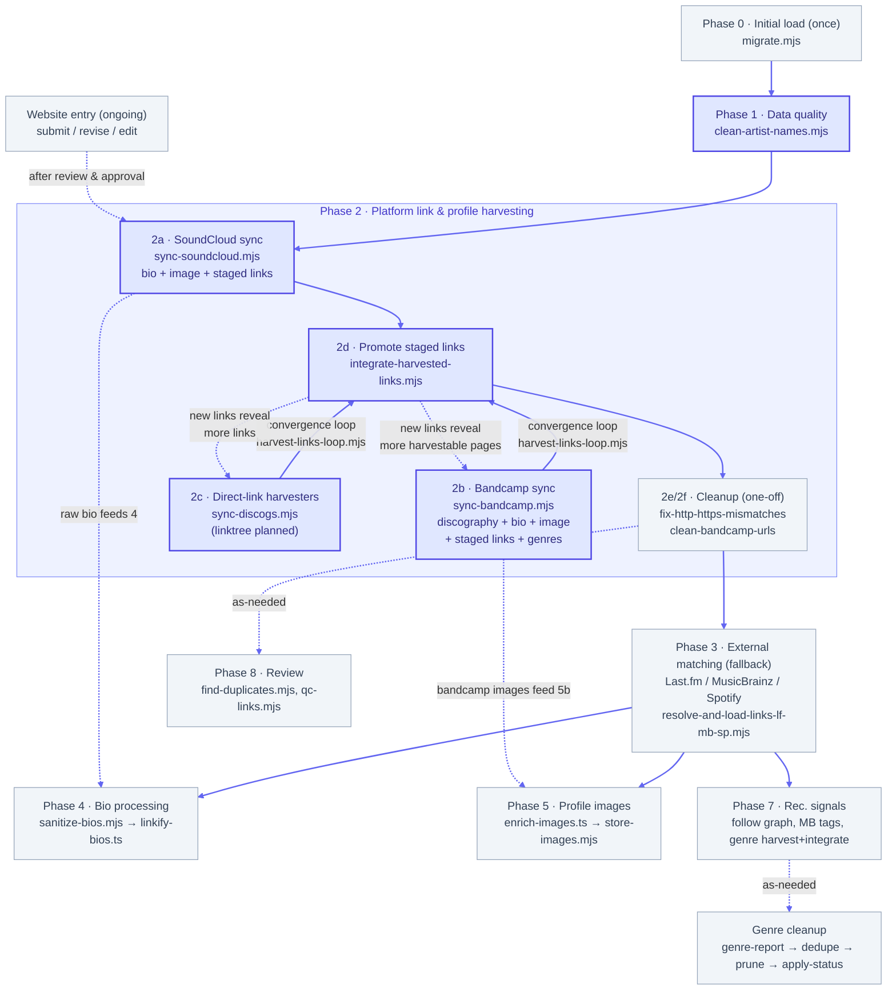

# Enrichment Pipeline

This document describes the logical order in which the enrichment
scripts should be run, and the purpose of each. The goal is to
eventually have a single `orchestrate.mjs` script that calls each
stage in order.

---

## Overview

```
Phase 0 │ Initial load (run once)
Phase 1 │ Data quality
Phase 2 │ Platform link & profile harvesting (SoundCloud, Bandcamp + direct links)
Phase 3 │ External matching fallback (Last.fm, MusicBrainz, Spotify)
Phase 4 │ Bio processing
Phase 5 │ Profile images
Phase 6 │ (merged into Phase 2b — Bandcamp discography & profile)
Phase 7 │ Recommendation engine signals
Phase 8 │ Review / data quality
```


*(Boxes with a bold border — Phase 1 and the Phase 2 harvest/promote stages (2a, 2b, 2c, 2d) — are run end-to-end by `orchestrate-platform-enrichment.mjs --approved`: 2a first, then 2b/2c/2d as a convergence loop (`harvest-links-loop.mjs`) until no new links appear. The 2e/2f cleanups are one-off and not orchestrated. Dashed arrows are as-needed, cross-phase, or manual-entry paths.)*

Artists enter the database through **two entry points**: the one-time
bulk CSV load (Phase 0), and continuously via the website's
submission/revision flow (see "Ongoing entry point" below, after
Phase 8). The enrichment phases run as bulk scripts, so artists
arriving through the website start with entry-form data only (plus an
auto-fetched profile image) and pick up the rest on the next pipeline
run. This is by design: human review and approval deliberately sit
between a website submission and enrichment.

---

## Orchestration

All of Phase 2 can be run end to end with a single command via
`orchestrate-platform-enrichment.mjs`:

```bash
npm run orchestrate-platform-enrichment -- --approved
```

It runs, in dependency order: `clean-artist-names` (Phase 1) →
`sync-soundcloud` (2a — the merged SoundCloud sync stage) →
`harvest-links-loop` (the 2b+2c+2d convergence loop). `sync-bandcamp`
(2b — the merged discography + bio + location + image + links +
genre-tags stage; see Phase 2b below) is now one of the loop's
harvesters rather than a terminal step, so each round re-runs it as 2d
promotes new Bandcamp links, and it converges alongside the other
harvesters. Each stage tracks its own processed state in the database,
so the orchestrator holds no state and is safe to re-run — a second
run only touches artists with new data. Note that `store-images.mjs`
(5b) is not part of this orchestrator; run it after the loop to pick
up any Bandcamp images 2b just found (see "Typical full run order").

`--approved` restricts every stage to directory artists
(`directory_status = 'approved'`, excluding deleted). It is forwarded to
each child stage, and `harvest-links-loop` forwards it again to its own
children, so one flag governs the whole loop. `clean-artist-names` is a
global name cleanup, so it is the one stage `--approved` is not passed
to. `DRY_RUN=1` (no writes anywhere) and an optional `--max-rounds=N`
(caps the convergence loop) are also honored.

This is the first concrete piece of the "eventual `orchestrate.mjs`"
referenced throughout this doc; later phases can be folded in as
additional stages.

---

## Phase 0 — Initial load *(run once)*

### `migrate.mjs`
Loads the master CSV (`women, femmes, enbies of electronic music - list (genres normalized).csv`)
into the database: artists, genres, locations, and platform links.
Also seeds the `pronouns` lookup from `pronouns_lookup.csv`
(`artists.pronoun_id` references it). Run once when setting up a
fresh database. Refuses to run if `artists` already has rows (to
prevent duplicates).

Prerequisite reference table: **`platforms`** `(key, label,
sort_order)` defines the valid values for `artist_links.platform`
and must be populated before any link-writing phase (2, 3) —
`integrate-harvested-links.mjs` validates keys against it. It is
not seeded by `migrate.mjs`; rows are managed in the admin settings
page (`src/app/admin/actions.ts`).

```bash
DRY_RUN=1 npm run migrate   # verify first
npm run migrate
```

---

## Phase 1 — Data quality

### `clean-artist-names.mjs`
Strips invisible Unicode characters (zero-width marks, control
characters, etc.) and whitespace from the start and end of every
artist name. Should be run after any import or bulk update, and
before enrichment scripts that use names as search queries.

```bash
npm run clean-artist-names
```

---

## Phase 2 — Platform link & profile harvesting

Principle: **gather every platform link we can from artist pages
directly, before relying on inferred matches.** Direct links found
on an artist's own profiles (SoundCloud web-profiles, Discogs,
Bandcamp, Linktree) are ground truth; the best-match resolution in
Phase 3 is the fallback for whatever this phase doesn't find.
Since platforms link to yet other platforms — including Last.fm,
Spotify, and MusicBrainz — a thorough pass here fills out the
artist's platform picture for everything downstream (images, bios,
matching, genres) and shrinks the set of artists that need
best-match guessing at all.

2a pulls from SoundCloud in a single merged stage; 2b is the merged
Bandcamp stage (`sync-bandcamp.mjs`, moved here from the former Phase 6
on 2026-07-10); 2c is the direct-link harvesters; 2d promotes; 2e/2f
clean up. 2b and 2c are both link harvesters, so they run inside the
2d convergence loop (`harvest-links-loop.mjs`) — links beget links, and
a Bandcamp page can reveal links just like a Discogs page can. (The
label "2b" previously belonged to a retired SoundCloud harvester,
`harvest-soundcloud-links-and-bio.mjs`, whose work is now part of 2a;
the slot is reused for Bandcamp.)

### 2a. `sync-soundcloud.mjs`
The merged SoundCloud stage (as of 2026-07-09; replaces the former
`enrich-soundcloud.mjs` + `harvest-soundcloud-links-and-bio.mjs`
pair, which each called `GET /resolve?url=<profile-url>` separately
for the same artist — the same call returning the same user
resource). This stage calls it once and fans the result out:

- **Profile data** — bio, follower count, track count, numeric user
  ID, and a playlists fallback for zero-track accounts (`GET
  /users/{id}/playlists`, only called when `track_count` is 0) —
  upserted into `artist_enrichment` (platform = `soundcloud`). Same
  behavior as the old 2a.
- **Profile image** — as of 2026-07-09, the resolved avatar goes to
  `artist_images` (`artist_id`, `platform='soundcloud'`), not
  `artist_enrichment.profile_image_url` (explicitly nulled there
  instead). Approved-only, unconditionally — checked inside
  `syncArtist()` itself regardless of which flags scoped the run,
  since this script otherwise processes non-directory artists too
  (~100x more numerous than directory ones) and there's no reason to
  store images for them. Image completion is tracked independently of
  the main `soundcloud-sync` completion (see "Image-only pass" below),
  since the two can diverge: an artist synced as a non-directory node
  and approved later needs just the image, not a full re-sync.
- **Other-platform links** — fetched via `GET
  /users/{urn}/web-profiles` (the "Links" section) plus a scan of the
  raw bio text for plain URLs and gate.sc-wrapped links — staged into
  `artist_harvested_links` (never written directly to `artist_links`;
  `integrate-harvested-links.mjs`, 2d, promotes it). Same behavior as
  the old 2b.
- **Raw bio** — the full, unparsed bio text is kept in
  `artist_harvested_bios` as a raw-bio audit trail, alongside the
  parsed/cleaned bio that reaches the live `artist_enrichment.bio`.

Two API calls per artist (`/resolve` + `/users/{urn}/web-profiles`)
is the floor — SoundCloud has no endpoint that returns the user
resource and web-profiles together — down from three under the old
two-script version.

**Wrong-field URL guard:** before calling `/resolve`, the stored
`artist_links.url` is checked against the `soundcloud.com` domain. A
mismatch (e.g. a Spotify URL saved in the SoundCloud field) is
skipped without spending an API call, logged to `harvest_failures`
(below), and — same as a 404 — marked processed in `resolved_artists`:
a domain mismatch doesn't fix itself on retry, so leaving it unmarked
would just re-write the same failure row and re-run the same guard
check every future run forever, for no benefit. The link-change
cross-check described below still picks it back up automatically once
a human corrects the link — no `--force` needed.

**Failure persistence:** every resolve/write failure — wrong-field
skips, 404s, transient resolve failures, and DB write failures — is
recorded in the `harvest_failures` table (service = `soundcloud-sync`,
via `scripts/lib/harvest-failures.mjs`: a short machine-readable
`status`, a human-readable `detail`, and the offending `url`), so a
scheduled/unattended run's failures are queryable afterward instead
of living only in console scrollback. A later successful sync clears
the row for that artist. Of the four failure statuses
(`wrong_field_url`, `resolve_404`, `resolve_failed`, `write_failed`),
`wrong_field_url` and `resolve_404` mark the artist processed
(permanent until a human fixes something); `resolve_failed` and
`write_failed` are presumed possibly-transient and retry on every run
regardless. A single local `fail()` helper inside `syncArtist()` is
the one place that decides which statuses mark the artist done (a
`markDone` flag), rather than that decision being repeated inline at
each failure site.

Processed state is tracked in the database (`resolved_artists`,
service = `soundcloud-sync`), not a cache file — per project
convention. An artist is skipped once a state row exists; re-runs
only touch artists that haven't been marked done. An artist is marked
processed once every write for it succeeds, or on a resolve HTTP 404
(definitive dead link) or a wrong-field URL (definitively not a
SoundCloud link); transient resolve/write failures are left unmarked
so the next run retries them.

A 404- or wrong-field-marked artist isn't stuck forever: `resolved_artists`
only records "done for this artist_id", not which URL was checked, so
a link fix wouldn't otherwise be picked up without `--force` (which
reprocesses everyone). Each run cross-references the URL
`harvest_failures` recorded at failure time against the artist's
current `artist_links` row (via `loadFailureUrls()` in
`scripts/lib/harvest-failures.mjs`); if they differ — a human
corrected the link since — that one artist is retried automatically.
(Found 2026-07-09: Maisie fixed a 404'd artist's link through the
admin UI and a re-run didn't pick it up — the cross-check was built to
fix that, then generalized to also cover `wrong_field_url` once it
became clear that status should mark the artist processed too, for
the same "doesn't fix itself on retry" reason as a 404.)

**Failures CSV:** every run (`DRY_RUN` or not) also writes a snapshot
of every current `soundcloud-sync` row in `harvest_failures` to a CSV
— `artist_name`, `rebalance_gender_url` (the artist's live page on the
site, `NEXT_PUBLIC_SITE_URL` + `/artist/{id}`, so a reviewer can click
straight through), `status`, `url` (the SoundCloud link that failed),
and `occurred_at`, sorted by status then most-recent-first. Written to
`sync-soundcloud-failures-<YYYY-MM-DD_HHMMSS>.csv` one level up from
this repo — the "Rebalance Gender" folder, not inside
`rebalance-gender-repo` — same convention as
`other-links-domain-counts.mjs`; the timestamped filename means
re-running never overwrites a previous run's report. See
`writeFailuresCsv()`.

**Image-only pass:** each run, `main()` separates already-synced
artists (a genuine `soundcloud-sync` success, not a still-unresolved
permanent failure) into a second bucket — those that are now approved
but still missing a soundcloud `artist_images` row — and runs
`syncArtist(artist, { imageOnly: true })` for them: one `/resolve`
call for the avatar, skipping playlists/web-profiles/bio/link writes
and leaving `resolved_artists` untouched. Image-only failures persist
to their own `harvest_failures` service (`image-sync:soundcloud`, via
`failImage()`), separate from `soundcloud-sync`'s, with the same
link-changed-since-failure cross-check applied independently — a 404
found only by the image-only path doesn't pollute the main sync's
(already-successful) failure state.

```bash
npm run sync-soundcloud
npm run sync-soundcloud -- --approved   # directory artists only
npm run sync-soundcloud -- --force      # re-process even artists with existing state
npm run sync-soundcloud -- --debug      # log raw API responses + every candidate link found
DRY_RUN=1 npm run sync-soundcloud       # fetch + log, no DB writes
```

`--approved` restricts the run to directory artists (`directory_status = 'approved'`, excluding deleted) rather than every artist with a SoundCloud link (mostly unvetted `sc_followee` follow-graph nodes).

Requires `SOUNDCLOUD_CLIENT_ID` and `SOUNDCLOUD_CLIENT_SECRET` in `.env.local`.

The per-artist sync is an exported `syncArtist()` function; the CLI
loop in `main()` is a thin driver over it — the same shape a future
event-triggered call (e.g. "sync this one artist from SoundCloud on
admin approval," the pattern `src/lib/enrich-images.ts` already uses
for images) can call directly for a single artist instead of a bulk
run.

Artists already synced under the old two-script system have
`resolved_artists` rows for `soundcloud-enrich` and
`soundcloud-harvest`, not `soundcloud-sync` — run
`backfill-resolved-soundcloud-sync.mjs` first (see "Utility /
diagnostic scripts") so the first bulk run of this stage doesn't
re-fetch everyone from scratch.

### 2b. `sync-bandcamp.mjs`
Merged 2026-07-09 (replaces `enrich-bandcamp.mjs`); moved here from the
former Phase 6 and folded into the convergence loop as 2b on
2026-07-10. The Bandcamp analog of `sync-soundcloud.mjs` (2a): one page
fetch per artist (`{core url}/music`, falling back to the core URL),
fanned out to every concern that page can answer instead of just
discography —

- **Discography** — album/track grid → `artist_bandcamp_albums` (the
  numeric IDs feed Bandcamp's embedded player). Same scrape
  `enrich-bandcamp.mjs` did.
- **Bio** → `artist_enrichment` (`platform = 'bandcamp'`), plus the
  raw bio into `artist_harvested_bios` as an audit trail (same pattern
  SoundCloud's bio gets).
- **Profile image** → as of 2026-07-09, `artist_images` (`artist_id`,
  `platform='bandcamp'`), not `artist_enrichment.profile_image_url`
  (explicitly nulled there instead). Written as a raw `source_url`
  only — re-hosting to Storage is `store-images.mjs`'s job (5b). No
  extra directory-only gating needed here (unlike SoundCloud): this
  whole script already only ever processes `directory_status =
  'approved'` artists, unconditionally — see "Processed state" below.
- **Location** → `artist_locations`, only when the artist doesn't
  already have a row there (never overwrites a manual entry).
- **External links sidebar** → staged into `artist_harvested_links`,
  same contract as every other harvester (promoted by
  `integrate-harvested-links.mjs`, 2d). This is what makes 2b a
  first-class member of the convergence loop, not just a profile
  scrape — see "Runs inside the 2d convergence loop" below.
- **Genre tags** (release pages only) → staged into
  `artist_harvested_genres` (`source_platform = 'bandcamp'`), same
  shape as the Last.fm/MusicBrainz/Spotify genre harvesters.

Handles three page shapes beyond the "full page with releases" case,
since Bandcamp reuses the same bio-container sidebar partial across
all of them: an artist with a bio but no releases (the `/music` page
stays on that path, just with an empty grid); an artist whose core URL
redirects to their one track (no `/music` landing page exists at all);
and an artist whose core URL redirects to a merch item. In all three,
discography is naturally empty but bio/location/links are still
harvested. A URL that isn't a real Bandcamp artist subdomain (e.g. a
saved `bandcamp.com/search?...` link) is rejected before any fetch —
see the wrong-field guard in the script header. Not harvested: fan/
supporter counts (loaded client-side, not in the static HTML) and
release credits text (captured opportunistically into `raw_data`, not
promoted to a column — a future collaboration-signal enhancement, same
status as Discogs' `members`/`groups`).

**Runs inside the 2d convergence loop.** Because 2b both *stages*
links (its sidebar → `artist_harvested_links`) and *consumes* links (it
needs a Bandcamp `artist_links` row to know which page to fetch), it
belongs in the same round-based loop as the direct-link harvesters (2c)
rather than as a terminal step: a Discogs page found in one round can
reveal a Bandcamp URL, 2d promotes it, and the next round's 2b then
reads that Bandcamp page — which may itself reveal more links. It is
listed in `harvest-links-loop.mjs`'s `HARVESTERS` array alongside
`sync-discogs.mjs`, so `orchestrate-platform-enrichment.mjs`
picks it up automatically; there is no separate Bandcamp stage in the
orchestrator anymore. Because it tracks processed state in the DB (see
below), each round only re-fetches artists whose Bandcamp link arrived
since the last round, so the loop still terminates naturally.

Benefits from the SoundCloud sync (2a) and the other harvesters
running: the more Bandcamp links they surface, the more profiles 2b
fetches.

Always directory-only: it processes only artists with
`directory_status = 'approved'` (excluding deleted), so there is no
`--approved` flag — the loop/orchestrator forwards one anyway, a
harmless no-op here.

**Processed state:** uses `resolved_artists` (service =
`bandcamp-sync`) and `harvest_failures` for processed-state and failure
tracking — same pattern as `sync-soundcloud.mjs` (2a). The old
`enrich-bandcamp.mjs` never used `resolved_artists`, so there's no
prior state to backfill.

```bash
npm run sync-bandcamp
```

### 2c. Direct-link harvesters

#### `sync-discogs.mjs` — ✅ one-call Discogs sync (2026-07-10, replaces `harvest-links-discogs.mjs`)
The Discogs analog of `sync-soundcloud.mjs`/`sync-bandcamp.mjs`, and the
successor to the link-only `harvest-links-discogs.mjs`. One call to the
official Discogs API (`GET /artists/{id}`) per artist, fanned out to
everything that resource answers:

- **External links** (`urls`) → staged into `artist_harvested_links`
  (source_platform = `discogs`); never written to `artist_links`
  directly — 2d promotes. (Same as the old harvester.)
- **Alt name spellings** (`namevariations`) → `artist_aliases`
  (deduped against existing aliases and the artist's own name; never a
  wholesale delete+insert, so human-entered aliases are preserved).
  Discogs `aliases` — *separate* personas/side-projects — are
  deliberately **not** written, since collapsing a different identity
  into one directory entry is usually wrong.
- **Real name** (`realname`) → `artist_legal_names` (`platform =
  'discogs'`), a **private** table with no public read (see
  `supabase_migration_artist_legal_names.sql`) — shared with HÖR's
  legal-name capture (`sync-hoer`). Kept for dedup/disambiguation,
  never shown publicly — exposing a legal name risks deadnaming or
  outing an artist who performs under a chosen name.
- **Profile text** (`profile`) → `biographies` (new table; `platform =
  'discogs'`), with Discogs `[a=]`/`[url=]`/`[b]` markup stripped to
  plain text; the raw text also goes to `artist_harvested_bios` as an
  audit trail (same as SoundCloud/Bandcamp). `biographies` is the new
  one-bio-per-artist-per-platform home for bios; SoundCloud/Bandcamp
  bios will be backfilled into it later.
- **Group membership** (`members`/`groups`) → `collaborations` (the
  renamed, platform-neutral `mb_collaborations`; `source_platform =
  'discogs'`), one undirected edge per pair, but **only** when the
  related Discogs artist is also in our DB (matched via its own Discogs
  link) — mirrors `enrich-musicbrainz.mjs`. This is the
  recommendation-engine payoff of the expanded sync.

Because it still stages links, it stays a full member of the 2c/2d
convergence loop. Processed state uses a **new** `resolved_artists`
service, `discogs-sync` (not the old harvester's `discogs-links`), so
the expanded sync re-processes everyone once to capture the new fields;
the old `discogs-links` rows are harmless and simply go unused. Failures
persist to `harvest_failures` (service `discogs-sync`) with the same
link-changed cross-check as the other sync scripts. Old-format
name-based Discogs URLs are still resolved to `/artist/<id>` via the
search API and rewritten back to `artist_links`. Throttled to ~55
req/min (Discogs allows 60/min authenticated).

```bash
npm run sync-discogs
npm run sync-discogs -- --approved    # directory artists only
npm run sync-discogs -- --limit=20    # test run
npm run sync-discogs -- --force       # re-process all
npm run sync-discogs -- --debug       # log every field/link classified
DRY_RUN=1 npm run sync-discogs        # fetch + log, no writes
```

`--approved` restricts the run to directory artists (`directory_status = 'approved'`, excluding deleted).

Requires `DISCOGS_TOKEN` in `.env.local` (discogs.com → Settings →
Developers → "Generate new token").

**Migrations to run first** (Supabase SQL editor):
`supabase_migration_collaborations.sql` (rename + `source_platform`),
`supabase_migration_biographies.sql` (new bios table), and
`supabase_migration_artist_legal_names.sql` (private real/legal-name table).

Still planned: `harvest-links-linktree.mjs` (or, following this pattern,
a `sync-linktree.mjs`). Bandcamp link harvesting is done — folded into
`sync-bandcamp.mjs` (2b) rather than built as a separate 2c script,
since it's the same page fetch as the discography scrape; 2b runs in
this same convergence loop.

#### `harvest-links-loop.mjs` — the 2b+2c+2d convergence loop
Runs the link harvesters — the 2c direct-link harvesters plus 2b
(`sync-bandcamp.mjs`, which stages the links from each Bandcamp
sidebar) — then 2d, in rounds until a round produces no new staged or
live links (links beget links: a Discogs page may reveal a Bandcamp
URL, 2d promotes it, and the next round's 2b reads that Bandcamp page
to reveal yet more links). Convergence is detected by row counts of
`artist_harvested_links` and `artist_links` before vs. after each
round; because harvesters track state in the DB, each round only
touches artists with new links. This loop is the skeleton for the
eventual `orchestrate.mjs`.

```bash
npm run harvest-links-loop
npm run harvest-links-loop -- --approved       # directory artists only
npm run harvest-links-loop -- --max-rounds=2
DRY_RUN=1 npm run harvest-links-loop           # single round, no writes
```

`--approved` restricts the loop to directory artists (`directory_status = 'approved'`, excluding deleted); it is forwarded to every child stage (the 2b/2c harvesters and 2d). `sync-bandcamp` is already directory-only, so the flag is a harmless no-op there.

### 2d. `integrate-harvested-links.mjs`
Promotes rows from the `artist_harvested_links` staging table into
the live `artist_links` table. One surviving link per
(artist, platform) pair is inserted if no link exists yet; if one
already exists, the script flags any discrepancy for review but
does not overwrite.

Staged rows whose `parsed_platform` isn't a key in the `platforms`
table are skipped (left in staging, reported in the run summary)
until the key is added via the admin settings page — then a re-run
promotes them. All platforms the current harvesters emit, including
`youtube`, `facebook`, and `tiktok` (keys added 2026-07-03), are
valid.

Discrepancy detection normalizes both URLs before comparing —
scheme, `www.`, trailing slash, and hostname case are ignored, and
known tracking/share params (Spotify's `si`/`nd`/`context`,
`utm_*`, Instagram's `igsh`/`igshid`, `fbclid`, `gclid`, YouTube's
`feature`/`pp`) are stripped — so a harvested link carrying a share
param doesn't falsely flag against a clean live URL.

```bash
node scripts/integrate-harvested-links.mjs
node scripts/integrate-harvested-links.mjs --approved   # directory artists only
```

`--approved` restricts promotion/flagging to directory artists (`directory_status = 'approved'`, excluding deleted).

### 2e. `fix-http-https-mismatches.mjs`
One-off cleanup (safe to re-run): rewrites `http://` links to
`https://` in `artist_harvested_links` and `artist_links`, and
clears any false mismatch flags caused by scheme differences alone.

```bash
node scripts/fix-http-https-mismatches.mjs
```

### 2f. `clean-bandcamp-urls.mjs`
One-off cleanup (safe to re-run, idempotent): rewrites Bandcamp
links that point at a specific album, track, releases, or follow
page down to the artist's core `https://<sub>.bandcamp.com` page —
in both `artist_links` (preserving the pre-strip value in
`original_url`, without clobbering an existing one) and
`artist_harvested_links`.

```bash
node scripts/clean-bandcamp-urls.mjs
node scripts/clean-bandcamp-urls.mjs --links-only       # artist_links only
node scripts/clean-bandcamp-urls.mjs --harvested-only   # artist_harvested_links only
node scripts/clean-bandcamp-urls.mjs --name="Erika"     # filter by artist name
DRY_RUN=1 node scripts/clean-bandcamp-urls.mjs           # preview
```

---

## Phase 3 — External matching (fallback)

The **fallback** for Last.fm, MusicBrainz, and Spotify links that
Phase 2's direct harvesting didn't find on artists' own pages: a
direct link is ground truth, a best match is an inference with a
confidence score. Runs directly after Phase 2 so all the
link-finding steps sit together in the process; its inputs are
only artist names, locations (`artist_locations`), and raw bios
(`artist_enrichment`, from 2a). Its links are then available to
the image and later phases. (It was formerly Phase 6, after
images; moved up and reframed as fallback 2026-07-03.)

Note: today the resolver only skips searching a service when the
artist already has a *Spotify* link; extending that skip to
Last.fm and MusicBrainz (so direct links found in Phase 2 suppress
the search entirely) is in "Planned changes".

### `resolve-and-load-links-lf-mb-sp.mjs`
Searches Last.fm, MusicBrainz, and Spotify for each directory
artist by name, scores and ranks candidates by name similarity,
location, and bio overlap, and upserts the best matches into
`artist_links`. Candidates below the confidence threshold
(`0.95`) are staged in `pending_artist_links` for manual review.

```bash
npm run resolve-and-load-links
```

State tracking: the resolver decides an (artist, service) pair is
already done by checking for existing `pending_artist_links` rows.
The orphaned `resolved_artists` table `(artist_id, service,
resolved_at)` — created in the dashboard, referenced by no code —
was evidently intended as an explicit tracker for exactly this.
Adopting it would make incremental re-runs cleaner than the current
inference (and fits the project preference for DB-tracked state
over cache files).

Full documentation of this script — flags, scoring, statuses, and
caveats — is in `MATCHING.md`. Note that no current-stack tool
processes the staged `close match` / `tie` / `pending` rows; the
legacy Python scripts (`review_candidates.py` export/import +
`load_links.py`) are still schema-compatible and remain the only
review workflow. See `MATCHING.md` for the comparison of the two
pipelines.

---

## Phase 4 — Bio processing

Must run after Phase 2 so bios are present in `artist_enrichment`.
No other phase depends on sanitized bios (Phase 3's matcher reads
the *raw* bios from 2a), so this can run any time before the site
displays them; it sits here to keep Phases 2–3, the link-finding
steps, adjacent.

### 4a. `sanitize-bios.mjs`
Runs every raw bio through `sanitize-html` (pure Node, no DOM
required — replaced `isomorphic-dompurify` 2026-07-05): strips
unsafe tags and attributes, converts bare newlines to `<br>` for
plain-text bios, adds `target="_blank" rel="noopener noreferrer"` to
all links. Writes to `bio_sanitized` in `artist_enrichment`. Skips
rows that already have `bio_sanitized` set (use `--force` to
re-sanitize). Uses keyset pagination on `id`, so `--limit` caps the
query itself rather than trimming an over-fetched batch.

```bash
npm run sanitize-bios
```

### 4b. `linkify-bios.ts`
Post-processes `bio_sanitized` to wrap bare URLs in `<a>` tags and
convert `@mentions` to SoundCloud profile links. Idempotent —
already-linked text is skipped.

```bash
npm run linkify-bios
```

---

## Phase 5 — Profile images

Runs after Phase 3 so image enrichment can draw on the full link
set, including the Last.fm, Spotify, and Wikipedia links Phase 3
resolves (all of which are in the platform priority list below).

### 5a. `enrich-images.ts` — multi-platform + `artist_images` 2026-07-09
For each artist with `directory_status = 'approved'` (checked inside
`enrichArtistImages()` itself, not just at the call site — no flag or
future caller can bypass it), tries **every** linked profile the
artist has, not just the first hit, and pulls the `og:image` meta tag
as a best-effort profile photo from each one. No API key required.
Supports `--limit=N`, `--force`, `--platforms=a,b`, and `DRY_RUN=1`.

Writes one row per successful platform to `artist_images`
(`artist_id`, `platform`, `source_url`, ...) — see
`supabase_migration_artist_images.sql` — rather than a single
`artists.profile_image_url` winner, so an artist can hold images from
several platforms at once instead of one platform's pick silently
overwriting another's. `soundcloud` and `bandcamp` are permanently
off-limits to this script (see `DEDICATED_HARVEST_PLATFORMS` in
`src/lib/enrich-images.ts`): those two have their own dedicated,
better-guarded harvesters (`sync-soundcloud.mjs`, `sync-bandcamp.mjs`),
and a generic `og:image` scrape must never clobber their pick, even
with `--force`.

No cache file — state lives in the DB. A platform is skipped once
`artist_images` has a row for it, or once `harvest_failures` has a
*confirmed* no-image result for it (`service = "image-enrich:
<platform>"`, `status = 'no_og_image'` — a genuinely transient failure,
like a timeout or 5xx, is NOT part of this skip set and is retried
every run). A brand-new link on a platform never tried before is
always attempted, force or not.

The single-artist core (`enrichArtistImages()`) lives in
`src/lib/enrich-images.ts` and is also called automatically by the
website — on admin quick-approve (`src/app/admin/actions.ts`), when
image-capable links are added on the artist edit page, and when a
single link is saved from the missing-links admin page — so newly
approved artists (or artists who just got a new link) get images
without waiting for a bulk run.

```bash
npm run enrich-images
```

As of 2026-07-09, `sync-soundcloud.mjs` (2a) and `sync-bandcamp.mjs`
(2b) also write directly to `artist_images` for their own
platforms — see those sections — so this script's role is exactly the
platforms it's the only source for: everything in `PLATFORM_PRIORITY`
except soundcloud/bandcamp.

### 5b. `store-images.mjs` — re-hosts every `artist_images` row 2026-07-09
Re-hosts profile images to Supabase Storage: walks every
`artist_images` row lacking a `storage_url` (every row, if `--force`),
downloads its `source_url` (applying the SoundCloud CDN 500×500 resize
rewrite only when `platform === 'soundcloud'`), and uploads it to
`artist-images/{artist_id}/{platform}.{ext}` — one Storage object per
platform, not one shared slot per artist, since an artist can now
display images from several platforms at once. Writes
`storage_url`/`storage_path`/`stored_at` back onto that row. No longer
picks a single "best" source or touches
`artists.profile_image_url/source/fetched_at` — every artist_images
row gets re-hosted, and the frontend picks which one to show (see 5c,
below). Supports `--limit=N`, `--force`, and `DRY_RUN=1`. Run any time
after 5a/2a/6 have found new images.

Failures (download/upload/DB-write errors) persist to
`harvest_failures` (`service = "image-store:<platform>"`) instead of
console-only — this was a known gap in the original single-winner
version (failures there only ever logged to console) and is fixed as
part of this rewrite.

```bash
node scripts/store-images.mjs
```

### 5c. Frontend read path — day-seeded rotation
`src/lib/artist-images.ts` exports `pickArtistImage(artistId, images,
date?)`: a deterministic pick from an artist's `artist_images` rows,
seeded by `artist_id` + today's date (UTC). Stable across a page's
render (no hydration mismatch, no per-visit flicker), rotates once a
day, needs no cron job or extra DB writes. Prefers `storage_url`;
falls back to `source_url` when 5b hasn't re-hosted that row yet, so a
newly-found image shows up immediately instead of waiting on the next
5b run.

`queries.ts`'s `ARTIST_SELECT` embeds `images:artist_images(...)` and
`normalizeArtist()` resolves it into `ArtistWithRelations.
displayImageUrl` — what `ArtistCard.tsx` and the artist page
(`src/app/artist/[id]/page.tsx`) render. `getRecommendedArtists()` and
`/api/discover` (`src/app/api/discover/route.ts`, both branches) do
the same resolution inline for their own lighter result shapes.
`artists.profile_image_url` (the legacy single-slot column) is no
longer read anywhere in the frontend.

### 5d. Pruning images — `prune-artist-images.mjs`
Two independent modes, exactly one required per run:

- `--platform=<platform>` — for the case a platform objects to being
  scraped. Deletes every Storage object re-hosted from that platform,
  the `artist_images` rows themselves, and any lingering
  `harvest_failures` rows for that platform's image services
  (`image-enrich:`, `image-sync:`, `image-store:` + platform, cleared
  globally), so a future re-add starts clean.
- `--non-directory` — every writer (5a, 2a, 2b, 5b, and the
  backfill migration) already restricts itself to `directory_status =
  'approved'` artists, so an `artist_images` row for a non-approved
  artist should only exist for one reason: approved once, demoted
  since (rejected, `not_eligible`, etc.) — see "Demoted artists" under
  Planned changes. Deletes those images (Storage object + row), and
  clears `harvest_failures` image-service rows scoped to just the
  affected artists (not globally, since other artists' images for the
  same platform are unaffected).

There's deliberately no "remove everything" mode — one of the two
flags above is always required.

```bash
node scripts/prune-artist-images.mjs --platform=bandcamp
node scripts/prune-artist-images.mjs --non-directory
DRY_RUN=1 node scripts/prune-artist-images.mjs --non-directory   # preview
```

---

## Phase 6 — Discography & profile enrichment → moved to Phase 2b

`sync-bandcamp.mjs` used to be its own terminal phase here. As of
2026-07-10 it is **Phase 2b**, a harvester inside the Phase 2
convergence loop (`harvest-links-loop.mjs`), because it harvests
platform links from the Bandcamp sidebar — and Bandcamp links are
themselves discovered mid-loop. Its full write-up (discography, bio,
image, location, links, genre tags, page-shape handling, processed
state) now lives under [Phase 2b](#2b-sync-bandcampmjs) above.

The Phase 6 number is left as this pointer rather than reused, so the
Phase 7 / Phase 8 numbering and every cross-reference to them stay
stable.

---

## Phase 7 — Recommendation engine signals

These scripts populate the signal tables used by the recommendation
engine. Run after Phase 3 so MusicBrainz IDs are available.

### 7a. `build-soundcloud-follow-graph.mjs`
For each approved directory artist with a SoundCloud link, fetches
their followings and writes directed edges to `sc_follow_edges`.
Also adds new artists discovered via followings to the `artists`
table with `directory_status = 'sc_followee'`.

```bash
npm run build-soundcloud-follow-graph
```

### 7b. `enrich-musicbrainz.mjs`
For each artist with a resolved MusicBrainz ID (written by Phase 3),
fetches their folksonomy tags and artist relationships. Tags go into
`mb_tags`; collaboration/membership edges where both artists are in
the database go into `collaborations` (the platform-neutral table,
`source_platform = 'musicbrainz'`; `sync-discogs.mjs` writes the same
table with `source_platform = 'discogs'`).

```bash
npm run enrich-musicbrainz
```

### 7c. `fetch-lastfm-similar.mjs`
For each directory artist with a Last.fm link (written by Phase 3),
calls `artist.getSimilar` and stores the results in
`lastfm_similar_artists`. Where a similar artist can be matched to
an existing row in the `artists` table (via Last.fm URL, MusicBrainz
ID, or name), `similar_artist_id` is populated — this is what makes
the data useful for weight tuning. Used as the validation / ground
truth dataset for the scoring step; not a live production signal.

After adding new Last.fm links (e.g. manually resolving ties in
`pending_artist_links`), run with `--resolve-only` to backfill
`similar_artist_id` for existing rows without making any API calls.

```bash
npm run fetch-lastfm-similar
npm run fetch-lastfm-similar -- --resolve-only
```

### 7d. `harvest-genres-mb.mjs`
Copies rows from `mb_tags` (populated by `enrich-musicbrainz.mjs` in
Phase 7b) into the `artist_harvested_genres` staging table with
`source_platform = 'musicbrainz'`. No API calls — purely a
database-to-database copy. Must run after 7b.

```bash
npm run harvest-genres-mb
```

### 7e. `harvest-genres-lastfm.mjs`
For each artist with a Last.fm link, calls `artist.getTopTags` and
writes the results into `artist_harvested_genres` with
`source_platform = 'lastfm'`. Stores the Last.fm weighting (0–100)
as `tag_count`. Results are cached to `.cache/lastfm_genres/`.
Must run after Phase 3 so Last.fm links are in `artist_links`.

```bash
npm run harvest-genres-lastfm
```

Requires `LASTFM_API_KEY` in `.env.local`.

### 7f. `harvest-genres-spotify.mjs`
For each artist with a Spotify link, calls `GET /artists/{id}` and
writes the returned genre array into `artist_harvested_genres` with
`source_platform = 'spotify'`. Spotify does not provide a per-genre
weight, so `tag_count` is null for these rows. Results are cached to
`.cache/spotify_genres/`. Must run after Phase 3.

```bash
npm run harvest-genres-spotify
```

Requires `SPOTIFY_CLIENT_ID` and `SPOTIFY_CLIENT_SECRET` in `.env.local`.

### 7g. `integrate-harvested-genres.mjs`
Promotes rows from `artist_harvested_genres` into the live `genres`
and `artist_genres` tables. For each unprocessed row:

- Looks up the raw tag in `GENRE_ALIASES` to resolve variant
  spellings (e.g. "drum and bass", "d&b", "dnb" → "drum & bass").
- Checks against `BROAD_TAGS` and marks overly vague tags as skipped
  (e.g. "electronic", "edm", "seen live") without creating genre entries.
- Finds or creates the canonical genre in the `genres` table, then
  inserts the `artist_genres` link.
- Sets `genre_id` on the harvested row to mark it as processed.

Both `GENRE_ALIASES` and `BROAD_TAGS` are constants near the top of
the script — edit them freely to tune which tags survive and what
canonical names they map to. Run `--force-skipped` after updating
`BROAD_TAGS` to re-process rows that were previously discarded.

Must run after 7d, 7e, and 7f.

```bash
DRY_RUN=1 npm run integrate-harvested-genres -- --debug --limit=50   # verify first
npm run integrate-harvested-genres
npm run integrate-harvested-genres -- --force-skipped   # after editing BROAD_TAGS
```

Full documentation of the genre lifecycle — the vocabulary/alias
system, the data model, the display rule (≥3-approved-artists
filter), and the cleanup toolkit below — is in `GENRES.md`.

---

## Phase 8 — Review / data quality

These scripts are run as-needed rather than on every pipeline run.

### `find-duplicates.mjs`
Read-only scan that scores potential duplicate artists based on
cross-platform handle similarity, shared contact emails, and name
fuzzy-matching. Outputs a CSV for manual review. Does not write to
the database.

```bash
npm run find-duplicates -- --output=duplicates.csv
```

### `qc-links.mjs`
Read-only validation of every row in `artist_links`. Detects
wrong-field entries (a URL stored under the wrong platform, e.g. a
musicbrainz.org URL in the lastfm field — and reports where it
should have gone) and format issues (whitespace, multiple URLs in
one field, unparseable URLs, plain `http://`, missing protocol).
Makes no changes; fix findings via the admin edit page. Useful
after any link-writing phase (2, 3).

```bash
node scripts/qc-links.mjs                     # check all rows
node scripts/qc-links.mjs --platform=lastfm   # one platform
node scripts/qc-links.mjs --name="Danz"       # artists matching name
node scripts/qc-links.mjs --limit=100         # first N artists
node scripts/qc-links.mjs --csv               # output issues as CSV
```

### Genre cleanup toolkit *(as-needed; see `GENRES.md`)*

Run `genre-report.mjs` first — it drives the rest. All support
`--dry-run` / `DRY_RUN=1`.

- **`genre-report.mjs`** — read-only. Writes `genre-report.csv`
  (artist counts, alias-merge candidates, suspected non-genres) and
  prints the artist-count distribution.
- **`dedupe-genres-by-alias.mjs`** — merges existing `genres` rows
  that only collide through the alias map (e.g. "drum & bass" /
  "drum'n'bass" / "dnb"), not just by normalized name.
- **`prune-genres.mjs`** — rolls tail subgenres into a parent, then
  cuts genres below an artist-count threshold (default 3;
  reversible unless `--hard`).
- **`apply-genre-status.mjs`** — applies hand-edited `status`
  changes from `genre-report.csv` back to the database.

```bash
node scripts/genre-report.mjs
node scripts/dedupe-genres-by-alias.mjs --dry-run
node scripts/prune-genres.mjs --dry-run --threshold=3
node scripts/apply-genre-status.mjs --dry-run
```

---

## Legacy scripts

The following scripts have been superseded and should not be included
in the automated pipeline:

- **`enrich-bios.mjs`** — early SoundCloud bio scraper that parsed
  SoundCloud's page HTML. Replaced by `sync-soundcloud.mjs` (Phase
  2a), which uses the official API and is more reliable.

- **`enrich-soundcloud.mjs`** (former 2a) and
  **`harvest-soundcloud-links-and-bio.mjs`** (former 2b) — merged
  2026-07-09 into `sync-soundcloud.mjs` (Phase 2a). Both called
  `GET /resolve?url=<profile-url>` separately for the same artist;
  the merged stage makes that call once and writes everything both
  scripts used to write. See Phase 2a above and "Planned changes" →
  "Merge the two SoundCloud scripts" for the full writeup.

- **`apply-review-csv.mjs`** — applies manual review decisions from
  a CSV file (setting `directory_status`, deleting duplicates, etc.).
  Manual CSV-based review is no longer the intended workflow.

- **`clean-linktree-bios.mjs`** — one-time backfill that extracted
  Linktree URLs embedded in bios and added them to `artist_links`
  (platform = `linktree`). `sync-soundcloud.mjs` (Phase 2a) now
  handles Linktree extraction as part of its bio processing, so new
  bios never need this pass. Safe to re-run, but no longer part of
  the pipeline.

- **Python candidate pipeline** (`resolve_candidates.py`,
  `review_candidates.py`, `load_links.py`, `recommend.py`, and the
  `recommender/` package) — the earlier standalone implementation of
  Phase 3 (external platform matching) plus a superseded
  recommendation engine. The Node script
  above was ported from it. Partially still useful: its review loop
  is the only tool for the staged-candidate backlog. Fully documented
  and compared against the current pipeline in `MATCHING.md`.

- **`compute-scores.mjs`** — Node version of the scoring step,
  superseded by the Python scoring pipeline (see `SCORING.md`).

---

## Utility / diagnostic scripts

Not part of the pipeline; run manually when debugging.

- **`test-connection.mjs`** — checks `.env.local` values and tries a
  raw fetch plus a supabase-js query against `artists`, printing
  everything. First stop when DB access misbehaves.
- **`test-queries.mjs`** — runs the directory's genre/country filter
  queries using the publishable key (exactly as the app does) to
  debug RLS or filter issues.
- **`update-artist-count.mjs`** — recomputes the approved-artist
  count and writes a rounded display value to `site_stats` so the
  homepage reads one row instead of counting on every request.
  Manual/local-test path only — a `pg_cron` job in
  `supabase_migration_site_stats.sql` already refreshes it daily if
  enabled.

  ```bash
  npm run update-artist-count
  ```
- **`commit-search-miss.sh`** (project root) — one-off git helper
  that committed the search-miss feature; safe to delete.
- **`test-xlsx.mjs`** (project root) — throwaway probe of the
  original spreadsheet's Beatport column; safe to delete.

- **`backfill-resolved-soundcloud-sync.mjs`** — one-off migration
  helper, written 2026-07-09 when the old 2a (`enrich-soundcloud.mjs`)
  + 2b (`harvest-soundcloud-links-and-bio.mjs`) pair merged into
  `sync-soundcloud.mjs` under a new state service,
  `soundcloud-sync`. For every artist with `resolved_artists` rows
  under BOTH old services (`soundcloud-enrich` AND
  `soundcloud-harvest` — i.e. fully synced under the old two-script
  system), seeds a `soundcloud-sync` row so the merged stage's first
  bulk run doesn't re-fetch everyone from SoundCloud. An artist with
  only one of the two old rows is left alone; `sync-soundcloud.mjs`
  picks it up on its own next run and does a full (cheap, 2-call)
  resync, which is correct since the old partial state doesn't cover
  everything the merged stage now writes (`harvest_failures` clears,
  the `artist_harvested_bios` audit trail, etc.).

  Same keyset-pagination approach and `--limit`/`--after` flags as
  `backfill-resolved-soundcloud-enrich.mjs` below. Idempotent — skips
  artist_ids that already have `soundcloud-sync` state.

  ```bash
  DRY_RUN=1 node scripts/backfill-resolved-soundcloud-sync.mjs            # preview, no writes
  node scripts/backfill-resolved-soundcloud-sync.mjs
  node scripts/backfill-resolved-soundcloud-sync.mjs --limit=200          # smaller batches per round-trip
  node scripts/backfill-resolved-soundcloud-sync.mjs --after=<artist_id>  # resume after this artist_id
  ```

- **`backfill-resolved-soundcloud-enrich.mjs`** — one-off migration
  helper, written 2026-07-03 when the old 2a switched from
  `enrich-soundcloud-cache.json` to `resolved_artists` (service =
  `soundcloud-enrich`) for processed-state tracking. Without it, the
  next 2a run would have treated every artist enriched before the
  switch as unprocessed and re-fetched them all from SoundCloud. Now
  superseded by `backfill-resolved-soundcloud-sync.mjs` above (the
  `soundcloud-enrich` service it targets is no longer written by any
  active script) — kept for the historical record, safe to delete.

  Reads `artist_enrichment` for rows where `platform = 'soundcloud'`
  and `external_id` is not null — `external_id` (the SoundCloud
  numeric user ID) is set on every row `enrich-soundcloud.mjs`
  successfully upserts, so its presence is a cheap, reliable stand-in
  for "this artist was already enriched." For each matching
  `artist_id` not already in `resolved_artists` for this service, it
  upserts `{ artist_id, service: 'soundcloud-enrich', resolved_at }`
  — `resolved_at` is stamped with the time the script runs (one
  timestamp for the whole batch), since the original per-artist
  enrichment time lives only in `artist_enrichment.last_synced_at`,
  which this script doesn't need to read.

  Both reads (`artist_enrichment` and `resolved_artists`) use keyset
  pagination — `WHERE artist_id > cursor ORDER BY artist_id LIMIT n`
  — instead of `OFFSET`-based paging. This matters in practice: the
  first version used `.range()` (OFFSET) and hit a Postgres statement
  timeout even on a single 1000-row page, because an OFFSET page over
  a filtered condition still has to walk (and often sort) everything
  before it. Keyset pagination lets Postgres seek straight to the
  cursor and stop as soon as it has enough matches, so `--limit`
  directly buys smaller, cheaper round-trips rather than just a
  smaller final result.

  Requires the `resolved_artists` grants fix
  (`supabase_migration_resolved_artists_grants.sql`) to be applied
  first — `service_role` had no SELECT/INSERT/UPDATE/DELETE on that
  table until then, so both the read and the write fail with
  "permission denied for table resolved_artists" otherwise.

  Idempotent and safe to re-run (skips already-marked artist_ids);
  safe to delete once the backfill is confirmed complete.

  ```bash
  DRY_RUN=1 node scripts/backfill-resolved-soundcloud-enrich.mjs            # preview, no writes
  node scripts/backfill-resolved-soundcloud-enrich.mjs
  node scripts/backfill-resolved-soundcloud-enrich.mjs --limit=200          # smaller batches per round-trip, if the full run times out
  node scripts/backfill-resolved-soundcloud-enrich.mjs --after=<artist_id>  # resume after this artist_id (printed on a --limit run)
  ```

---

## Shared libraries (`scripts/lib/`)

- **`name-utils.mjs`** — strips invisible Unicode/whitespace from
  artist names; provides `isBlankArtistName()`. Used by
  `clean-artist-names.mjs` and the Phase 3 resolver.
- **`linktree.mjs`** — finds/removes Linktree URLs in bio text. Used
  by `enrich-bios.mjs` and `clean-linktree-bios.mjs`.
- **`soundcloud-bio.mjs`** — SoundCloud bio parsing shared by
  `enrich-bios.mjs` (legacy) and `sync-soundcloud.mjs`.
- **`harvest-failures.mjs`** — `recordFailure()` / `clearFailure()`
  helpers against the `harvest_failures` table (one row per
  `artist_id`/`service`, holding the *current* failure — a later
  success clears it). Used by `sync-soundcloud.mjs`; intended to be
  reused by future Phase 2 harvesters instead of each one inventing
  its own failure-tracking shape.
- **`non-genre-hints.mjs`** — heuristics (places, decades, roles,
  library junk) flagging `genres` rows that probably aren't musical
  genres. Used by `genre-report.mjs` for its `suspected_non_genre`
  column; human-review-only, never auto-cuts.
- **`scoring.py`** — signal loading, Supabase client, pair
  enumeration, and Jaccard scoring for the Python scoring pipeline
  (see `SCORING.md`).

---

## Ongoing entry point — website submissions, revisions, and edits

The bulk CSV load (Phase 0) ran once; since then, artists enter and
change through the website. This flow is handled by the Next.js app,
not pipeline scripts, but it feeds the same tables the pipeline
enriches — an approved submission is, in effect, a new Phase 0 row
for one artist.

### New artist submission

```
/submit form → POST /api/submit
  ├─ artists                (directory_status = 'unverified';
  │                          'pending' if the email is already verified)
  ├─ artist_labels          (labels from the form)
  ├─ pronouns               (new values created on demand; artists.pronoun_id)
  ├─ artist_locations       (city/country from the form)
  ├─ artist_links           (platform links from the form)
  ├─ submitter_emails       (reputation upsert: submission_count++)
  └─ verification_tokens    (target_type 'artist') → verification email

email link → /api/verify
  ├─ artists                'unverified' → 'pending'  (into review queue)
  └─ submitter_emails       'unverified' → 'verified'

admin panel → quickApprove (src/app/admin/actions.ts)
  ├─ artists                directory_status = 'approved'
  └─ auto-runs single-artist image enrichment in the background
     (src/lib/enrich-images.ts — the Phase 5a core)
     [alternatives: 'rejected', 'not_eligible']
```

**Enrichment after approval (by design):** after approval an artist
has only their form data and (maybe) a profile image. SoundCloud
enrichment (Phase 2), external links (3), bio processing (4), image
re-hosting (5b), genres (7), and similarity scores (`SCORING.md`) are
picked up on the next bulk run. Per-artist versions of these phases,
triggered on approval, are a possible future convenience —
`quickApprove`'s image enrichment is the template — but the periodic
bulk-run model, with human review in front of it, is intentional.

### Edit suggestion from the public

```
/artist/[id]/revise → POST /api/revise
  ├─ artist_revisions       (status 'unverified', proposed changes
  │                          as a revision_data jsonb blob)
  ├─ submitter_emails       (reputation upsert)
  └─ verification_tokens    (target_type 'revision') → email

email link → /api/verify    revision 'unverified' → 'pending'

admin panel → approve/reject
  └─ approved: revision_data applied to artists / artist_links /
     artist_labels / etc.
```

An approved revision that adds or changes platform links logically
re-enters the pipeline the same way a new artist does (the changed
links affect Phases 2, 3, 5, 6, and 7 for that artist).

### Direct edit (admin / owner)

`/artist/[id]/edit` writes `artist_aliases` and `artist_labels`
wholesale (delete + insert), plus links and core fields, and
auto-runs image enrichment when new image-capable links are added.
`artist_aliases` (alternate names) exists only in this flow — no
pipeline script or submit form touches it.

### Reference and reputation tables

- **`platforms`**, **`pronouns`** — lookups; see Phase 0.
- **`submitter_emails`** — per-email reputation
  (`unverified`/`verified`/`blocked`, submission count, block
  reason). Written by `src/lib/submission-helpers.ts`, `/api/verify`,
  and admin actions; managed in admin settings. Verified emails skip
  the verification step on later submissions.
- **`verification_tokens`** — single-use tokens backing both flows
  above (`target_type` = `artist` | `revision`, expiry, `used_at`).
  Issued by `src/lib/submission-helpers.ts` / `src/lib/email.ts`,
  consumed by `/api/verify`.

### Loose ends

- **`artist_harvested_bios`** — resolved 2026-07-09: `sync-soundcloud.mjs`
  (Phase 2a) writes the full, unparsed SoundCloud bio here as a
  deliberate raw-bio audit trail, alongside the parsed/cleaned bio it
  writes to the live `artist_enrichment.bio`. No promotion step was
  built (and none is planned) — this table is intentionally an audit
  record of what SoundCloud actually returned, not a staging table
  awaiting an "integrate" step.
- **`resolved_artists`** — orphaned resolver state table; see the
  note under Phase 3.
- **`harvest_failures`** — new 2026-07-09 (see Phase 2a and
  `scripts/lib/harvest-failures.mjs`): one row per (`artist_id`,
  `service`) holding the *current* failure for that pair, cleared on
  the next success. Written by `sync-soundcloud.mjs`
  (service = `soundcloud-sync`), `sync-bandcamp.mjs`
  (service = `bandcamp-sync`), and, as of 2026-07-10, `sync-discogs.mjs`
  (service = `discogs-sync`); adopting it in the remaining Phase 2
  harvester (Linktree, when built) is still open.

---

## Typical full run order

```bash
npm run clean-artist-names
npm run sync-soundcloud
# Phase 2 link-harvest convergence loop (2b+2c+2d) —
# or run the whole loop at once with `npm run harvest-links-loop`
npm run sync-discogs            # 2c
npm run sync-bandcamp           # 2b (also discography, bio, image, genres)
node scripts/integrate-harvested-links.mjs   # 2d
node scripts/fix-http-https-mismatches.mjs   # 2e
node scripts/clean-bandcamp-urls.mjs         # 2f
npm run resolve-and-load-links
npm run sanitize-bios
npm run linkify-bios
npm run enrich-images
node scripts/store-images.mjs
npm run build-soundcloud-follow-graph
npm run enrich-musicbrainz
npm run fetch-lastfm-similar
npm run harvest-genres-mb
npm run harvest-genres-lastfm
npm run harvest-genres-spotify
npm run integrate-harvested-genres
```

---

## Planned changes

Agreed optimizations and cleanups. Items marked ✅ DONE are
implemented; the rest are still open.

### Merge the two SoundCloud scripts into one "SoundCloud sync" stage — ✅ DONE (2026-07-09)

`enrich-soundcloud.mjs` (2a) and `harvest-soundcloud-links-and-bio.mjs`
(2b) each called `GET /resolve?url=<profile-url>` for the same artists —
the same call returning the same user resource. Merged into
`sync-soundcloud.mjs` (Phase 2a — see above), which:

- **Cuts API calls from 3 to 2 per artist.** One `/resolve` (profile
  data + bio + urn) followed by one `/users/{urn}/web-profiles`
  (links). Two is the floor — SoundCloud has no endpoint that returns
  the user resource and web-profiles together. (The conditional
  `/users/{id}/playlists` call for zero-track artists is unaffected.)
- **Unifies the bio path.** The parsed/cleaned bio still goes to the
  live `artist_enrichment.bio`; the full raw bio is additionally kept
  in `artist_harvested_bios`, now wired up on purpose as a raw-bio
  audit trail (decided: keep, not drop — see "Loose ends").
- **Gives orchestration a single per-artist-callable unit.** The
  exported `syncArtist()` function is the "sync this artist from
  SoundCloud" unit — usable for a future event-triggered flow (run on
  approval) as well as the bulk CLI loop that calls it today.

Artists synced under the old two-script system need
`backfill-resolved-soundcloud-sync.mjs` run once to carry their
processed state over to the new `soundcloud-sync` service (see
"Utility / diagnostic scripts") before a bulk `sync-soundcloud.mjs`
run, otherwise it re-fetches everyone from scratch.

### Skip `/resolve` on re-runs using the stored user ID

`sync-soundcloud.mjs` already stores each artist's numeric SoundCloud
user ID in `artist_enrichment`. Re-runs (or a links-only refresh) can
call `/users/{urn}/web-profiles` and `/users/{id}` directly from the
stored ID instead of re-resolving the profile URL: 1 call per artist
for a links refresh, and immune to resolve failures when an artist
renames their profile URL.

### Generalize `store-images.mjs` (5b) to all image sources — ✅ DONE (2026-07-09)

5b previously re-hosted only SoundCloud images: it sourced from
`artists.sc_image_url` / the `soundcloud` row of `artist_enrichment`,
applied a SoundCloud-CDN-specific `-t500x500` resize rewrite, and
hardcoded `profile_image_source = 'soundcloud'`. Images that 5a
fetched from other platforms (Bandcamp, Resident Advisor, Discogs, …)
stayed hot-linked to the source site — vulnerable to URL rot, and
every source domain had to be allowlisted in `next.config` for
`next/image`.

There was also an override bug: 5b's "already stored" check only
skipped Storage URLs, so an artist whose image 5a chose from Bandcamp
got silently overwritten with the re-hosted SoundCloud image if one
existed.

Built: 5b now walks the same `PLATFORM_PRIORITY` order as
`enrich-images.ts` (5a) — a local copy, since this script runs under
plain `node` and 5a's list lives in a `.ts` file — picking the
highest-priority platform with an available source image (SoundCloud's
`sc_image_url` / enrichment row, or any other platform's
`artist_enrichment.profile_image_url`, e.g. the one `sync-bandcamp.mjs`
now writes). The resize rewrite applies only when the picked source is
actually SoundCloud. The override bug is fixed as a side effect: an
artist is only treated as "already done" when the Storage image's
recorded `profile_image_source` matches the *current* best-priority
source, so a higher-priority image that appeared since (or a Storage
image from the wrong source) gets re-hosted instead of silently kept.
Once every image is served from our own Storage domain, the
per-source allowlist in `next.config` can be reduced to just that
domain.

### Multi-image `artist_images` table — ✅ DONE (2026-07-09)

Replaced the one-image-per-artist model (`artists.profile_image_url`
plus one row per platform squatting in `artist_enrichment`) with
`artist_images` — one row per `(artist_id, platform)`, so an artist can
hold images from several platforms at once and the frontend rotates
between them instead of one platform's pick silently overwriting
another's. See `supabase_migration_artist_images.sql` for the schema
and full rationale.

Built: the table; `enrich-images.ts` (5a), `sync-soundcloud.mjs` (2a),
and `sync-bandcamp.mjs` (2b) all writing to it instead of
`artist_enrichment.profile_image_url`; `store-images.mjs` (5b)
re-hosting every row to its own per-platform Storage path; the
frontend read path (5c) picking a day-seeded image per artist;
`prune-artist-images.mjs` (5d, `--platform=X` or `--non-directory`)
for purging one platform's images or a demoted artist's leftover ones.
Failure persistence extends across all three writers now
(`image-enrich:<platform>`, `image-sync:<platform>` for SoundCloud's
image-only pass, `image-store:<platform>` for 5b's re-hosting) —
closing the gap flagged when 5b was still the single-winner version
(its download/upload failures used to be console-only).
`build-soundcloud-follow-graph.mjs` (Phase 7-ish; discovers non-
directory follow-graph nodes) no longer writes
`artist_enrichment.profile_image_url` either — found and fixed
2026-07-09 after the rest of this work landed; it's not one of the
three image writers above and was never migrated to `artist_images`,
just stopped writing an image at all, consistent with "directory-only,
unconditionally."

**Demoted artists:** the original decision here was to leave a demoted
artist's (`approved` → `rejected`/`not_eligible`/etc.) images in place
rather than purge them — reversed 2026-07-09: `prune-artist-images.mjs
--non-directory` now exists specifically to sweep these up, run
on-demand or periodically.

**Migration order for existing data:**

1. `supabase_migration_artist_images.sql` (Supabase SQL editor) —
   creates the table.
2. `supabase_migration_backfill_artist_images.sql` (Supabase SQL
   editor) — copies existing images (`sc_image_url`, every
   `artist_enrichment.profile_image_url` row, and `artists.
   profile_image_url`/`profile_image_source` for platforms neither of
   those already cover) into `artist_images`, for approved artists
   only. `ON CONFLICT DO NOTHING` throughout, so it's safe to re-run
   and never overwrites a row a live script already wrote. Skipping
   this step doesn't break anything going forward — every writer works
   from an empty table just fine — but every image already harvested
   before this change would otherwise need re-fetching from scratch
   instead of being reused.
3. `node scripts/store-images.mjs` (terminal, not the SQL editor) —
   run once to re-host the backfilled (and freshly-harvested) rows to
   Storage.

**Before dropping any of the legacy columns** (`artists.
profile_image_url`, `profile_image_source`, `profile_image_fetched_at`,
`sc_image_url` — none of which any writer or the frontend reads
anymore, but which are deliberately left in place rather than dropped
in this same change): run the backfill above first, so nothing that
only ever lived in those columns is lost. They're otherwise safe to
drop in a follow-up migration whenever confidence is high enough —
nothing currently depends on them.

**Schema reconciliation — done (2026-07-09):** cross-checked a live
schema dump of `artists`, `artist_enrichment`, `artist_images`, and
`harvest_failures` against every migration file and everything the
pipeline code reads/writes. Everything matches except one confirmed
gap: `artists.sc_image_url` does not exist on the live database —
`supabase_migration_sc_image_url.sql` was never applied there. Step 1
of the backfill migration already guards for this (checks
`information_schema.columns` first, skips with a `RAISE NOTICE`
instead of erroring). `src/lib/types.ts`'s `Artist` interface declared
`sc_image_url` as if it were live; removed, with a comment explaining
why. No code referenced the field outside that declaration, and
`tsc --noEmit` is clean. Nothing else outstanding — code side of this
refactor is fully done; the only remaining step is Maisie running the
three-item migration order above.

### Build out Phase 2c: the direct-link harvesters

The pipeline doc now places all direct link gathering in Phase 2
(before best-match inference in Phase 3); these are the scripts
that implement it:

```
Phase 2c:
  harvest-links-discogs.mjs     ✅ BUILT (2026-07-03) — see Phase 2c
  harvest-links-linktree.mjs    see below
  harvest-links-bandcamp.mjs    ✅ DONE (2026-07-09) — folded into
                                sync-bandcamp.mjs (Phase 2b) instead of
                                built as a separate script, since it's
                                the same page fetch as the discography
                                scrape. Stages into artist_harvested_links
                                same as every other harvester here.

After Phase 3 (needs resolved MusicBrainz IDs):
  MB URL-rels                   move the url-rel harvesting inside
                                enrich-musicbrainz.mjs (7b) to write to
                                artist_harvested_links staging instead
                                of directly to artist_links, then
                                promote via 2d
  harvest-links-wikidata.mjs    possible — MB url-rels often include a
                                Wikidata item, whose structured claims
                                (official site, Instagram, Discogs /
                                SoundCloud / Bandcamp IDs) have a real
                                API; currently wikidata.org is in
                                enrich-musicbrainz's SKIP_DOMAINS
```

All new harvesters write to the `artist_harvested_links` staging
table — never directly to `artist_links` — so 2d's promotion and
conflict-flagging applies uniformly. Run 2c + 2d in a loop until no
new links appear (links beget links).

**The 2c + 2d convergence loop is BUILT (2026-07-03):
`harvest-links-loop.mjs`** — see Phase 2c. It is the orchestrator
in miniature: stage scripts run as child processes, per-artist
processed state in the database (`resolved_artists` is now adopted —
service `discogs-links`), convergence detected by before/after row
counts, loop stops when a round produces nothing new. The full
`orchestrate.mjs` grows from this skeleton: each later phase becomes
another stage plugged into the same pattern. Future harvesters just
get added to the `HARVESTERS` array in the loop script.

### Skip best-match search when a direct link exists

`resolve-and-load-links-lf-mb-sp.mjs` currently skips searching
only Spotify when the artist already has a Spotify link; Last.fm
and MusicBrainz are searched regardless (the load step won't
overwrite, but the API calls and staged candidates are wasted, and
a wrong best-match candidate can sit in `pending_artist_links`
next to a correct direct link). Extend the existing Spotify-style
skip to all three services, so Phase 2's direct links suppress
Phase 3 work entirely for those (artist, service) pairs.

### Persist harvest failures as queryable data — ✅ DONE for SoundCloud + Bandcamp (2026-07-09)

Previously a fetch/resolve failure in the Phase 2 scripts existed only
as a console line and an in-memory tally — once the terminal
scrolled, the information was gone. The only durable trace was
indirect: transient failures left no `resolved_artists` row (so they
retried next run), and 404s marked the artist processed without
recording *why*. Built: a `harvest_failures` table
(`supabase_migration_harvest_failures.sql`) — one row per
(`artist_id`, `service`) holding the *current* failure, cleared on the
next success, with a machine-readable `status`, human-readable
`detail`, and the offending `url`. Chosen over adding `status`/`detail`
columns to `resolved_artists` so that table's simple skip-set
semantics (used by every stage's "is this artist already done" check)
stay untouched. `sync-soundcloud.mjs` and `sync-bandcamp.mjs` write to
it via the shared `scripts/lib/harvest-failures.mjs` helper
(`recordFailure()` / `clearFailure()`); wiring the remaining Phase 2
harvesters (Discogs, and whatever Linktree harvester gets built) onto
the same table is still open. (Built after a real case: an artist
whose `soundcloud`
link field contained a Spotify URL failed `/resolve`, was 404-marked
processed, and left no record of the underlying bad link — see the
guard below, which now catches that case before it burns an API call.)

### Guard harvesters against wrong-field URLs — ✅ DONE for SoundCloud + Bandcamp (2026-07-09)

Cheap pre-check in each Phase 2 fetcher: before spending an API
call, verify the stored URL's domain actually matches the platform
being processed. Built into `sync-soundcloud.mjs`: the stored
`artist_links.url` is checked against `soundcloud.com` before
`/resolve` is called; on mismatch it's skipped and flagged (via
`harvest_failures` above) instead of calling the API, and — unlike a
404 — left unmarked in `resolved_artists` so a later link correction
is retried automatically. `sync-bandcamp.mjs` does the same against
`*.bandcamp.com` (rejecting both non-Bandcamp URLs and the bare
`bandcamp.com` apex — e.g. a saved search-results link). The Discogs
harvester (`harvest-links-discogs.mjs`) already effectively does this
via its artist-ID regex (`discogs.com/artist/`). Wrong-field rows are
exactly what `qc-links.mjs` (Phase 8) detects after the fact; this
catches them at point of use too.

Considered and set aside: Spotify (API exposes no external links),
Last.fm (none structured; page links mostly mirror MB's), Resident
Advisor (links exist on ra.co artist pages but only via an
unofficial GraphQL endpoint — fragile; revisit later), Beatport /
Qobuz / Tidal / Apple Music pages (no meaningful outbound links). A
future Linktree harvester should adopt the same guard when it's built.

### New harvester: `harvest-links-discogs.mjs` ✅ BUILT (2026-07-03)

The link harvesting described below is implemented (see Phase 2c).
Not yet implemented from this entry: using `namevariations` /
`aliases` to populate `artist_aliases`, `profile` text as a bio
fallback, and `members`/`groups` as a collaboration signal — those
remain future enhancements.

Discogs is currently only a link *destination* (CSV slugs via
`migrate.mjs`, SoundCloud web-profiles via 2a, MusicBrainz url-rels
via 7b) — nothing reads *from* it, even though it has an official,
free REST API. `GET https://api.discogs.com/artists/{id}` returns:

- a `urls` array of external links — often extensive for electronic
  artists (Bandcamp, SoundCloud, RA, socials, personal sites);
- `namevariations` and `aliases` — could populate `artist_aliases`,
  which today is only written by manual edits;
- `profile` text — a bio fallback for artists with no SoundCloud bio;
- `members` / `groups` — a potential collaboration signal.

Plan: extract the artist ID from stored `discogs.com/artist/{id}`
URLs in `artist_links`, fetch each artist, and write links to the
`artist_harvested_links` staging table so `integrate-harvested-links.mjs`
(2d) handles promotion and conflict-flagging exactly as it does for
SoundCloud finds. Rate limit is 60 req/min with a free personal
token — the full directory in ~25 minutes. Before building, run
`node scripts/qc-links.mjs --platform=discogs` to gauge how many
stored Discogs links are valid (the CSV-derived ones were
best-effort).

### New harvester: `harvest-links-linktree.mjs`

Artists with an `artist_links` row for `linktree` (extracted from
SoundCloud bios by 2a, or submitted/edited directly) already have a
seed URL, and Linktree pages exist precisely to list an artist's
other platforms. Harvesting the links from each artist's Linktree
page and staging them in `artist_harvested_links` (same promotion
path as above) would recover much of what Instagram bios contain —
without scraping Instagram, which was considered and rejected: Meta's
ToS prohibits automated collection, logged-out requests hit login
walls, the official APIs expose no third-party profile data, and any
scraper would break constantly. Pronouns should instead come from the
site's own submit/revise forms, and follower counts already come from
SoundCloud and Spotify.

(Note: Linktree URLs used to also live in a separate
`artists.linktree_url` column; that's been retired in favor of
`artist_links` only — see `scripts/migrate-linktree-to-links.ts` for
the one-time migration. This harvester should read its seed URLs from
`artist_links` (platform = `linktree`), not from `artists`.)

### Related cleanups to fold in

- Adopt `resolved_artists` (or equivalent DB-tracked state) instead
  of cache-file / inference-based "already processed" checks — see
  the Phase 3 note and the project preference for DB state.
  **2a (`soundcloud-enrich`) and 2b (`soundcloud-harvest`) were both
  done (2026-07-03)** — both dropped their `*-cache.json` files for
  `resolved_artists` rows, matching the 2d convention. Artists
  enriched before the switch were backfilled via the one-off
  `backfill-resolved-soundcloud-enrich.mjs` — see "Utility /
  diagnostic scripts" below for how it works.

  **2026-07-09: 2a and 2b merged into `sync-soundcloud.mjs`, service
  `soundcloud-sync`.** The merge carried the DB-state convention
  forward unchanged — no cache file was reintroduced anywhere in the
  new stage, confirmed by inspection of `sync-soundcloud.mjs` (its
  only persistence calls are to `resolved_artists`,
  `harvest_failures`, `artist_enrichment`, `artist_harvested_links`,
  `artist_harvested_bios`, and `artist_links`). A new backfill,
  `backfill-resolved-soundcloud-sync.mjs`, carries state from the two
  old services over to the new one for artists that had both — see
  "Utility / diagnostic scripts".

  **✅ Fully resolved for SoundCloud — re-confirmed 2026-07-09** after
  the failures-CSV addition below introduced the script's one
  `fs.writeFileSync` call: that write is a timestamped, human-readable
  *report* (`sync-soundcloud-failures-<timestamp>.csv`, one level up
  from the repo — see Phase 2a), not a processed-state cache. It's
  never read back by the script and plays no role in the "already
  processed" skip logic, so it doesn't reintroduce the pattern this
  cleanup removed.

  **Found while running that backfill (2026-07-03): `resolved_artists`
  was missing basic table grants** — `service_role` had no
  SELECT/INSERT/UPDATE/DELETE on it, only REFERENCES/TRIGGER/TRUNCATE/
  MAINTAIN, so *every* script touching it (2a, 2b, `harvest-links-discogs.mjs`,
  `harvest-links-loop.mjs`, the backfill script) failed with
  "permission denied for table resolved_artists" — meaning the 2d
  Discogs harvester likely never successfully recorded state in
  production. Fixed by `supabase_migration_resolved_artists_grants.sql`
  (run in the Supabase SQL editor) — grants `service_role` full CRUD,
  matching every other service_role-only table (e.g.
  `artist_enrichment`).

  **The Phase 3 resolver (`resolve-and-load-links-lf-mb-sp.mjs`) is now
  done (2026-07-05)** — its processed state was already derived from
  `pending_artist_links` (via `alreadyResolved()`), and its `.cache/`
  disk-JSON response cache was moved into the `api_response_cache` table
  (`supabase_migration_api_response_cache.sql`; see MATCHING.md → "Response
  cache (DB-backed)").

  Still open: the genre harvesters' `.cache/` directories.
- Replace the `.cache/` disk caches used by the genre harvesters with
  DB-tracked state.
